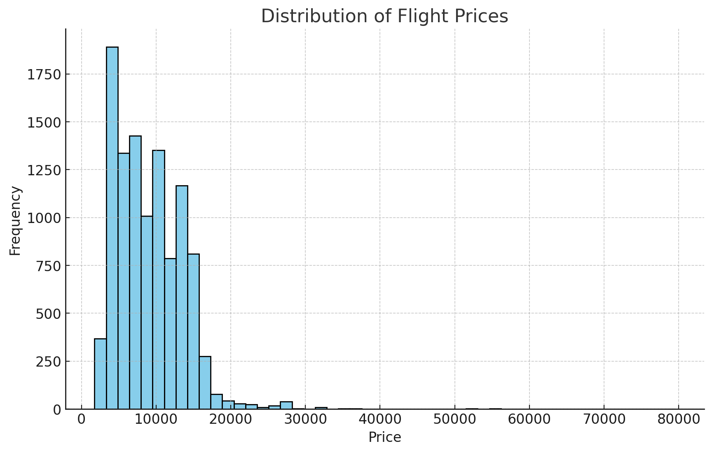
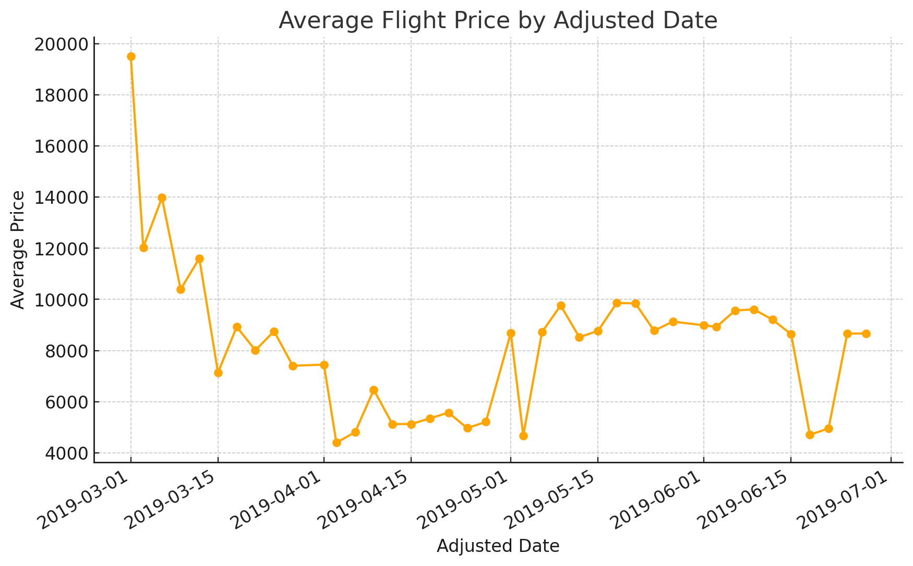
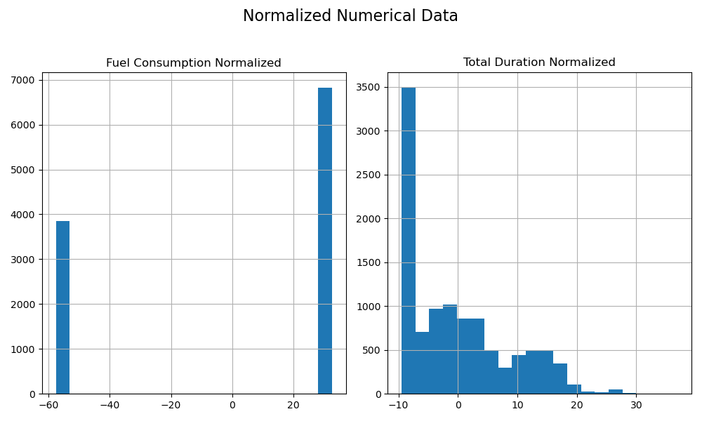
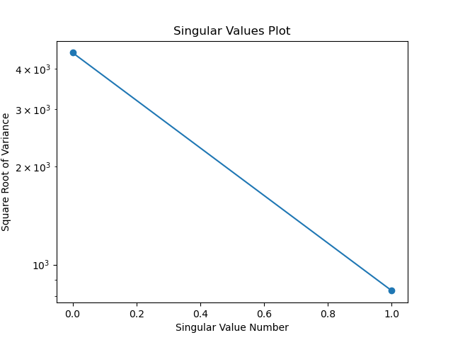
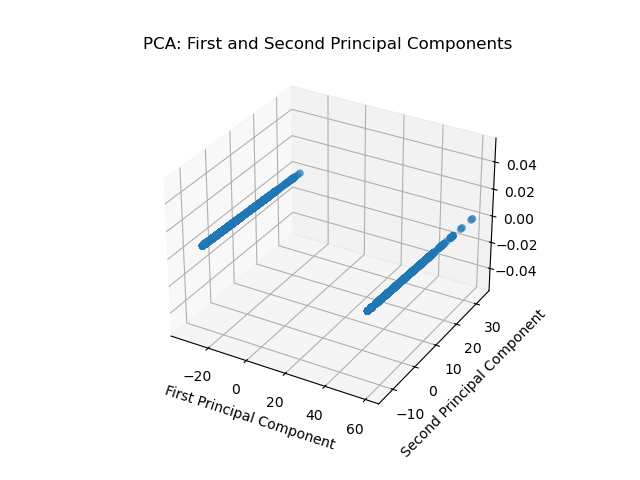

## Exploratory Data Analysis of Indian Domestic Flights (March - June 2019)

The dataset includes domestic flights of Indian airlines from March 2019 to June 2019, and is derived from [Kaggle](https://www.kaggle.com/datasets/viveksharmar/flight-price-data/). Each column in the dataset corresponds to a specific variable, and each row represents an observation. The dataset is clean, with consistent measurement units and no missing values.

### Dataset Variables:
- **Airlines**: The name of the airline operating the flight.
- **Source and Destination**: Cities where the flights originate and land.
- **Total Stops**: The number of stops made by the flight.
- **Price**: The ticket price for the respective flight.
- **Date, Month, and Year**: The specific date on which the flight is scheduled.
- **Departure and Arrival Times**: Detailed departure and arrival hours and minutes.
- **Duration**: The total duration of the flight in hours and minutes.

### Correlation Analysis:
We explored possible correlations between variables in the dataset. One expected correlation is between flight price and flight duration. Using the `cor` function in Julia, we found a positive correlation of **0.51** between these two variables. Similarly, the correlation between the number of stops and price is **0.60**. It makes sense that as the number of stops increases, the flight distance and, consequently, the price also increase.

The chart depicted in **Figure 1** illustrates that most flights in the dataset have ticket prices below 10,000 Rupees.

  
   
  <strong>Figure 1:</strong> Distribution of Flight Prices (Positive Skew).

### Seasonal Price Variations:
To analyze seasonal price variations, we created a new column, `Adjusted-Date`, by combining the values from the `Date`, `Month`, and `Year` columns into a single date format. We then plotted the mean price over time using this adjusted date.
As shown in **Figure 2**, flight prices fluctuate significantly over time, with notable peaks around the major Indian holidays.

  
   
  <strong>Figure 2:</strong> Flight price trends over time.

These price variations can be correlated with the seasonal demand and cultural events during this period. Upon reviewing the price fluctuations, we explored the major holidays in India during this period to identify possible correlations between price peaks and holidays. Interestingly, many of the price peaks align with Indian holidays. For example:
- In March, price spikes around March 4th and 21st coincide with **Maha Shivaratri** and **Holi**, respectively.
- In April, a price increase occurs around April 13th and 14th, aligning with **Ram Navami**, **Baisakhi**, and **Tamil New Year/Vishu**.
- In May, a price increase is observed around May 1st (coinciding with **May Day**) and May 18th (coinciding with **Buddha Purnima**).
- High prices persist into early June, corresponding with **Eid-ul-Fitr** (June 4th) and **Ganga Dussehra** (June 12th).

### Destination Analysis:
We reviewed **10,684** flights during this period. **Cochin**, **Bangalore**, and **Delhi** were the top destinations, with Cochin being the most attractive, receiving the highest number of flights. The details of the top destinations are shown in **Table 1**.

**Table 1: Top Flight Destinations**

| Rank | Destination | Count |
|------|-------------|-------|
| 1    | Cochin      | 4,537 |
| 2    | Bangalore   | 2,871 |
| 3    | Delhi       | 1,265 |
| 4    | New Delhi   | 932   |
| 5    | Hyderabad   | 697   |
| 6    | Kolkata     | 381   |

### Origin-Destination (O/D) Pair Analysis:
We also identified the most frequent origin-destination pairs, as shown in **Table 2**.

**Table 2: Most Frequent Origin-Destination Pairs**

| Rank | Source   | Destination | Count |
|------|----------|-------------|-------|
| 1    | Delhi    | Cochin      | 4,537 |
| 2    | Kolkata  | Bangalore   | 2,871 |
| 3    | Bangalore| Delhi       | 1,265 |
| 4    | Bangalore| New Delhi   | 932   |
| 5    | Mumbai   | Hyderabad   | 697   |
| 6    | Chennai  | Kolkata     | 381   |

### Airline Insights:
Our analysis of the airlines provided the following insights:

#### 1. Mean Price by Airline:
The table below (**Table 3**) shows the mean flight price for each airline, sorted from highest to lowest.

**Table 3: Mean Price by Airline**

| Rank | Airline                      | Mean Price (INR) |
|------|------------------------------|------------------|
| 1    | Jet Airways Business          | 58,359           |
| 2    | Jet Airways                   | 11,644           |
| 3    | Multiple Carriers Premium     | 11,419           |
| 4    | Multiple Carriers             | 10,903           |
| 5    | Air India                     | 9,611            |
| 6    | Vistara Premium Economy       | 8,962            |
| 7    | Vistara                       | 7,796            |
| 8    | GoAir                         | 5,861            |
| 9    | IndiGo                        | 5,674            |
| 10   | Air Asia                      | 5,590            |
| 11   | SpiceJet                      | 4,338            |
| 12   | Trujet                        | 4,140            |

#### 2. Airlines with the Most Number of Flights:
The table below (**Table 4**) lists the airlines with the most flights in the dataset.

**Table 4: Airlines with the Most Number of Flights**

| Rank | Airline                      | Number of Flights |
|------|------------------------------|-------------------|
| 1    | Jet Airways                   | 3,849             |
| 2    | IndiGo                        | 2,053             |
| 3    | Air India                     | 1,752             |
| 4    | Multiple Carriers             | 1,196             |
| 5    | SpiceJet                      | 818               |
| 6    | Vistara                       | 479               |
| 7    | Air Asia                      | 319               |
| 8    | GoAir                         | 194               |
| 9    | Multiple Carriers Premium     | 13                |
| 10   | Jet Airways Business          | 6                 |
| 11   | Vistara Premium Economy       | 3                 |
| 12   | Trujet                        | 1                 |

#### 3. Airlines Frequently Used in Long-Haul Flights:
The table below (**Table 5**) lists the airlines frequently used for long-haul flights (flights with a duration greater than 10 hours).

**Table 5: Airlines Frequently Used in Long-Haul Flights**

| Rank | Airline                      | Long-Haul Flights |
|------|------------------------------|-------------------|
| 1    | Jet Airways                   | 2,395             |
| 2    | Air India                     | 1,178             |
| 3    | Multiple Carriers             | 625               |
| 4    | IndiGo                        | 231               |
| 5    | Vistara                       | 197               |

It is worth noting that there is limited data available for multiple-carrier flights, so further analysis of these flights is not possible.

### Singular Value Decomposition (SVD) and Principal Components Analysis (PCA):

Before beginning with SVD or even PCA, we must normalize the data. Since most of our variables are categorical, only two variables needed to be normalized. These two variables are Fuel_Consumption_normalized and CO2_Emitted_normalized, and their normalization values are shown in the bar chart below, in **Figure 3**. This provided a preview that perhaps SVD and PCA would not be needed, given the small number of numerical variables. 

  
   
  <strong>Figure 3:</strong> Bar chat showing the normalization of our two numerical variables.

Since there are only two numerical variables to be analyzed in this dataset, only two singular values were created, as can be seen below in **Figure 4**.

  
   
  <strong>Figure 4:</strong> Line plot with two points representing two singular values.

As we only have 2 numerical variables, it makes sense that most of the data points are concentrated around the first and second principal components, because they correspond to the two numerical variables. This can be seen below in **Figure 5**. Of course, there are the only two principal components. Because we have such few numerical variables, if we were to use PCA, we might lose valuable information. Hence, we will proceed with regression analysis in the next section of our project. 

  
   
  <strong>Figure 5:</strong> First and second principal components.

