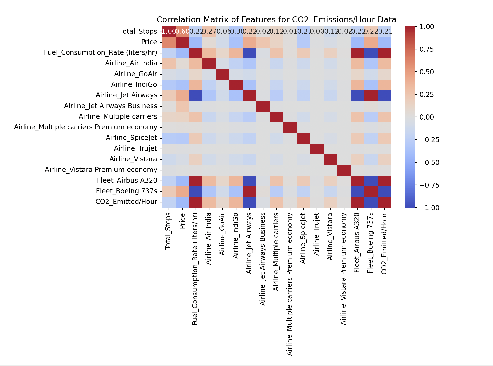

# Decision Tree Analysis

This section is dedicated to decision tree analysis. Because the dependent variable is not categorical, the DecisionTreeRegressor from scikit-learn was employed. 
After the first decision tree was created, using the original dataset (with Duration_hours and Duration_min combined into a single variable Total_Duration), the $R^2$ value was 0.99. This value seemed suspiciously close to perfect. 
The effect of the high correlation value can also be seen in the figure below, which is a plot of the actual vs predicted values, and as can easily be seen, the predicted values fall almost perfectly along the actual values. This is also evidenced by the very small RMSE value, 0.39.

  
   
  <strong>Figure 14:</strong> Actual vs predicted values for the original dataset

To understand the origins of this $R^2$ value, firstly, a correlation plot was created. The first correlation plot is seen below in Figure 14:

  
   
  <strong>Figure 15:</strong> Correlation matrix created using the original dataset.

As can be seen from the figure above, the highest correlation appears between Total_Duration and CO2_Emitted (US Ton), the dependent variable. This makes sense, of course, because the longer the plane is in flight, the more $CO_2$ will be emitted. 

In order to question this highly suspicious result, we divided the original dependent variable, CO2_Emitted (US Ton), by Total_Duration to create a new dependent variable called CO2_Emitted/Hour. We created a second decision tree and plotted the actual and predicted values, as seen in Figure 15. We then noticed the appearance of two clusters, which indicates that there must be a variable(s) that is causing a binomial distribution.
The $R^2$ value for the second decision tree was  0.99, which is lower than the original but still very close to perfect. The RMSE value was also very low, at 0.0034. 

  
   
  <strong>Figure 16:</strong> Actual vs predicted values using CO2_Emitted per Hour as a dependent variable.

To figure out what variable could be causing this binomial distribution, we used RandomForestRegression from scikit-learn to see which features were the most important.

  
   
  <strong>Figure 17:</strong> Most important features using CO2_Emitted per Hour as a dependent variable.

We see that the fleet, Boeing 737s is the most important feature when using CO2_Emitted/Hour as a dependent variable. Originally, we removed the Fleet variable to create the first correlation plot since it is a binary variable, and, of course, it was showing 2 very red (ie, highly correlated) squares for the value Boeing 737s and its counterpart, Airbus A320. However, we see, thanks to Figure 10, that it would be important to bring the Fleet variable back because it is causing the binomial distribution seen in Figure 17.

The histogram below also shows the binomial nature of the data:

  
   
  <strong>Figure 18:</strong> Distribution using CO2_Emitted/Hour as a dependent variable.

After transforming our dependent variable to CO2_Emitted/Hour and creating another correlation matrix, we saw a high correlation between each of the Fleet variable values (Boeing 737s and Airbus A320) and the dependent variable CO2_Emitted/Hour, which confirms that Fleet has an important effect on the data and is likely responsible for the binomial nature of the distribution in Figure 18. We also see a high correlation between the dependent variable and the variable Fuel_Consumption_Rate (liters/hour). Again, this makes sense because the faster a plane uses its fuel, the more $CO_2$ will be emitted. 

  
   
  <strong>Figure 19:</strong> Correlation matrix created using CO2_Emitted per Hour as a dependent variable.

Because of the high correlation between Fuel_Consumption_Rate (liters/hour) and CO2_Emitted/Hour, the next thing we tried was to divide the original dependent variable, CO2_Emitted (US Ton), by Fuel_Consumption_Rate (liters/hour) and created a new dependent variable called CO2_Emissions/Fuel_Usage_Rate. We again checked the most important features, now using CO2_Emissions/Fuel_Usage_Rate as the dependent variable. It is clear to see that the most important feature is Total_Duration, so clearly Total_Duration and Fuel_Usage_Rate are variables that greatly affect the emission of $CO_2$.

  
   
  <strong>Figure 20:</strong> Most important features using CO2_Emitted per Fuel Usage as a dependent variable.

This is also confirmed by the correlation matrix below, as we see a high correlation between CO2_Emissions/Fuel_Usage_Rate and Total_Duration.

  
   
  <strong>Figure 21:</strong> Correlation matrix created using CO2_Emitted/Fuel_Usage_Rate as a dependent variable.

However, we also see a suspiciously perfect match between the actual and predicted values when CO2_Emitted/Fuel_Usage_Rate is used as the dependent variable. The $R^2$ value for this decision tree was 0.99, which is slightly higher value than the original $R^2$ value. The RMSE value, however, was the highest of all three decision trees at 9.19x10-5. This is a very small value and significantly smaller that the previous RMSE values. The RMSE value for this last model was $10^4$ times smaller than the RMSE for the first decision tree and $10^2$ times smaller than the RMSE value for the second decision tree.

  
   
  <strong>Figure 22:</strong> Actual vs predicted values using CO2_Emitted/Fuel_Usage_Rate as a dependent variable.

The histogram below also shows that the variable Fuel_Usage_Rate is also binomial in nature:

  
   
  <strong>Figure 23:</strong> Distribution of Fuel_Usage_Rate.

Despite experimenting with various decision tree models and hyperparameter tuning, we were unable to achieve an $R^2$ value that provided any meaningful insights without appearing suspiciously close to 1. This is indicative of potential overfitting and suggests that the dataset itself may have limitations. The high correlations between certain features, ie Total_Duration and Fuel_Consumption_Rate with CO2_Emitted, led us to question the authenticity of the data. If the data were generated synthetically, and therefore lacks or lacked sufficient variability, it would explain the difficulty in deriving meaningful models. This highlights the importance of ensuring that datasets used for machine learning are diverse and representative of real-world findings. Without these properties, even the most sophisticated models will be unable to yield reliable findings.

