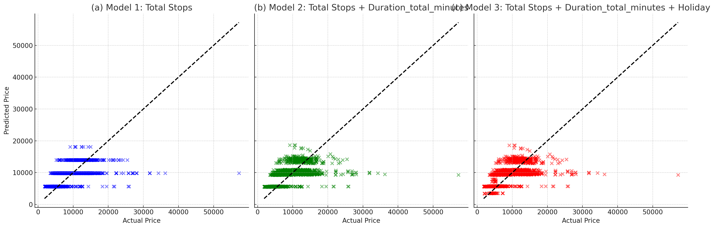

# Implementing Linear Regression Models for Price Prediction

In this section, we first implemented a simple linear regression model for price prediction based on our dataset, to better understand the independent variables and their influence on the results. Then, we proceeded to enhance the model based on our findings.

To begin with, we developed a simple linear regression model using the `LinearRegression` module from the `scikit-learn` package. This package fits a linear model with coefficients (w = (w_1, ..., w_p)) using the ordinary least squares (OLS) method to minimize the residual sum of squares between the observed targets in the dataset and the targets predicted by the linear approximation, as shown in Equation (1) [(scikit-learn documentation)].(https://scikit-learn.org/stable/modules/linear_model.html\#ordinary-least-squares)

**Equation (1):**
$$\min_w\|\| Xw - y\|\|_2^2 $$

Based on our exploratory analysis, we chose the number of stops as an independent variable, as this variable has a 60\% correlation with price. For simplicity, we did not use cross-validation in our first step and simply divided the data into 75\% for training and 25\% for testing. This resulted in the model shown in Equation (2):

**Equation (2):** 
$$\text{Price} = 5669.74 + 4150.40 \times \text{Total Stops}$$

To evaluate the performance of the model, we calculated three different metrics: root mean squared error (RMSE), mean squared error (MSE), and \( R^2 \) coefficient, which were 3613.11, \( 1.3 e+07), and 0.36, respectively. As you can see, the model's performance is poor.

To enhance the model, we added another independent variable, flight duration in minutes, as this variable has a 50\% correlation with price. This resulted in the model formulated in Equation (3), with RMSE, MSE, and \( R\^2 \) metrics of 3586.91, \( 1.28 e+07), and 0.37, respectively.

**Equation (3):**
$$\text{Price} = 5447.66 + 3496.11 \times \text{Total Stops} + 1.19 \times \text{Flight Duration}$$

Although the second model performs slightly better than the first one, it is still not satisfactory. Therefore, we adjusted the dataset to consider holidays as well. We added a binary variable named `Holiday` to the dataset, which equals 1 when the flight is on the following dates: Maha Shivaratri (March 4), Holi (March 21), Ram Navami (April 13), Baisakhi (April 14), May Day (May 1), Buddha Purnima (May 18), Eid-ul-Fitr (June 4), and Ganga Dussehra (June 12). In this way, we reached the model presented in Equation (4):

**Equation (4):**
$$\text{Price} = 5534.45 + 3455.92 \times \text{Total Stops} + 1.17 \times \text{Flight Duration} - 2212.58 \times \text{Holiday}$$

The RMSE, MSE, and \( R^2 \) metric values for this model are 3571.72, \( 1.27 e+07 \), and 0.38, respectively. As you may notice from the above results and also **Figure 6**, all of the models are unable to provide good estimations of the price, and their performance is poor. This may be the result of not using cross-validation or the linear regression model being unsuitable for our purpose.

  
   
  <strong>Figure 6:</strong> Performance of models 1(a), 2(b), and 3(c).

To test these theories, we first implemented cross-validation with 5 folds, as this is common and ensures both computational efficiency and performance balance. To do so, we used the third model, the best one we had so far. This led to a slight enhancement in the results. The metrics are presented in **Table 6**:

**Table 6: Performance Metrics for Model 4**

| **Metric** | **Fold Values**                                                                                          | **Mean Value**   | **SD**       |
|------------|----------------------------------------------------------------------------------------------------------|------------------|--------------|
| RMSE       | [3731.48, 3732.26, 3636.08, 3468.79, 3627.01]                                                            | 3639.12          | 96.31        |
| MSE        | [13,923,954.82, 13,929,781.75, 13,221,049.43, 12,032,485.40, 13,155,213.99]                              | 13,252,497.08    | 694,039.12   |
| \( R^2 \)  | [0.378, 0.369, 0.377, 0.380, 0.379]                                                                      | 0.377            | 0.004        |

The relatively low performance of linear models suggests that the relationships between the variables in the dataset may be non-linear or involve complex interactions between variables. Therefore, we implemented Decision Trees, Ensemble Methods, and Neural Networks to develop a more suitable model.

