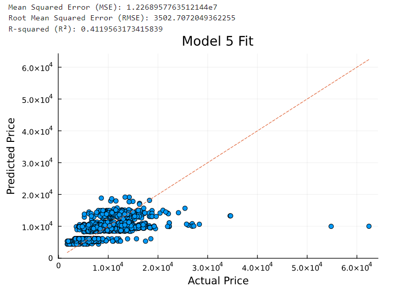
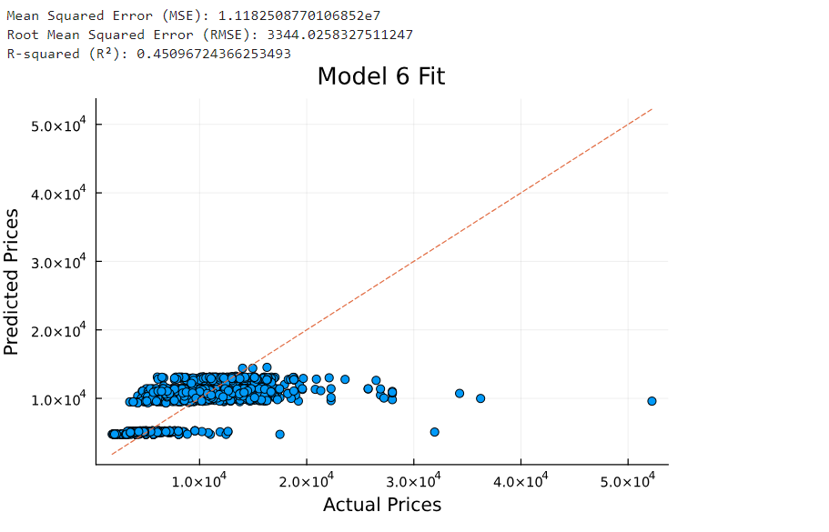
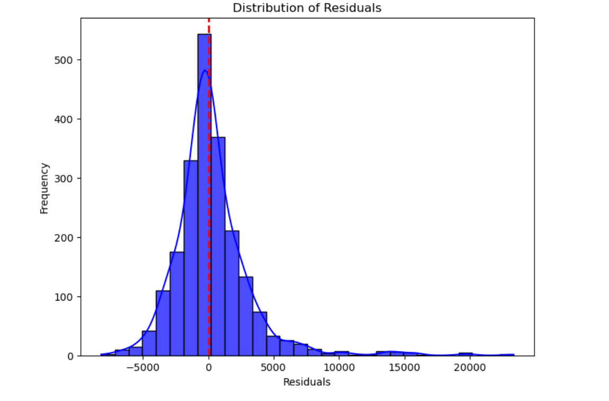
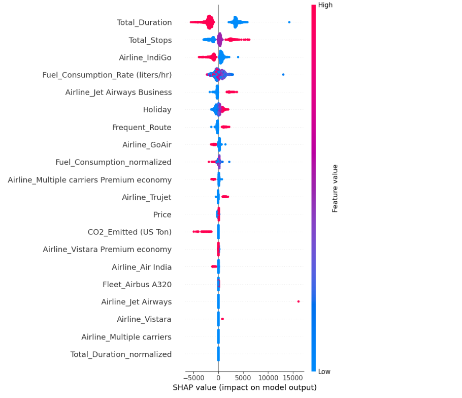
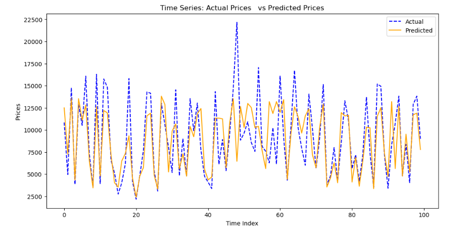

# Implementing Linear Regression Models for Price Prediction

In this section, we first implemented a simple linear regression model for price prediction based on our dataset, to better understand the independent variables and their influence on the results. Then, we proceeded to enhance the model based on our findings.

To begin with, we developed a simple linear regression model using the `LinearRegression` module from the `scikit-learn` package. This package fits a linear model with coefficients (w = (w_1, ..., w_p)) using the ordinary least squares (OLS) method to minimize the residual sum of squares between the observed targets in the dataset and the targets predicted by the linear approximation, as shown in Equation (1) [(scikit-learn documentation)](https://scikit-learn.org/stable/modules/linear_model.html\#ordinary-least-squares).

**Equation (1):**
$$\min_w\|\| Xw - y\|\|_2^2 $$

Based on our exploratory analysis, we chose the number of stops as an independent variable, as this variable has a 60\% correlation with price. For simplicity, we did not use cross-validation in our first step and simply divided the data into 75\% for training and 25\% for testing. This resulted in the model shown in Equation (2):

**Equation (2):** 
$$\text{Price} = 5669.74 + 4150.40 \times \text{Total Stops}$$

To evaluate the performance of the model, we calculated three different metrics: root mean squared error (RMSE), mean squared error (MSE), and \( R^2 \) coefficient, which were 3613.11, \( 1.3 e+07), and 0.36, respectively. As you can see, the model's performance is poor.

To enhance the model, we added another independent variable, flight duration in minutes, as this variable has a 50\% correlation with price. This resulted in the model formulated in Equation (3), with RMSE, MSE, and \( R\^2 \) metrics of 3586.91, \( 1.28 e+07), and 0.37, respectively.

**Equation (3):**
$$\text{Price} = 5447.66 + 3496.11 \times \text{Total Stops} + 1.19 \times \text{Flight Duration}$$

Although the second model performs slightly better than the first one, it is still not satisfactory. Therefore, we adjusted the dataset to consider holidays as well. We added a binary variable named `Holiday` to the dataset, which equals 1 when the flight is on the following dates: Maha Shivaratri (March 4), Holi (March 21), Ram Navami (April 13), Baisakhi (April 14), May Day (May 1), Buddha Purnima (May 18), Eid-ul-Fitr (June 4), and Ganga Dussehra (June 12). In this way, we reached the model presented in Equation (4):

**Equation (4):**
$$\text{Price} = 5534.45 + 3455.92 \times \text{Total Stops} + 1.17 \times \text{Flight Duration} - 2212.58 \times \text{Holiday}$$

The RMSE, MSE, and \( R^2 \) metric values for this model are 3571.72, \( 1.27 e+07 \), and 0.38, respectively. As you may notice from the above results and also **Figure 6**, all of the models are unable to provide good estimations of the price, and their performance is poor. This may be the result of not using cross-validation or the linear regression model being unsuitable for our purpose.

  
   
  <strong>Figure 6:</strong> Performance of models 1(a), 2(b), and 3(c).

To test these theories, we first implemented cross-validation with 5 folds, as this is common and ensures both computational efficiency and performance balance. To do so, we used the third model, the best one we had so far. This led to a slight enhancement in the results. The metrics are presented in **Table 6**:

**Table 6: Performance Metrics for Model 4**

| **Metric** | **Fold Values**                                                                                          | **Mean Value**   | **SD**       |
|------------|----------------------------------------------------------------------------------------------------------|------------------|--------------|
| RMSE       | [3731.48, 3732.26, 3636.08, 3468.79, 3627.01]                                                            | 3639.12          | 96.31        |
| MSE        | [13,923,954.82, 13,929,781.75, 13,221,049.43, 12,032,485.40, 13,155,213.99]                              | 13,252,497.08    | 694,039.12   |
| \( R^2 \)  | [0.378, 0.369, 0.377, 0.380, 0.379]                                                                      | 0.377            | 0.004        |

As we can observe the performance of the Model 4 is quite low, So we decided to add one more feature "Attractive Destination" in binary form, Added number of holidays and festivals throughout the year as well as we divided the data into 80% for training and 20% for testing. We arranged the "Attractive Destination" feature in such a way that the origin and the destination mentioned in the Table 2 will be 1 and other will be 0.

**Equation (5):**
Price = 5869.27 + 3701.61 x Total Stops - 930.98 x Holiday + 1.01 x Flight Duration - 659.77 x Attractive Destination

  
   
  <strong>Figure 7:</strong> Performance of model 5

The performance metrics RMSE, MSE and R2 observed from this model are 3502.70, \( 1.22 e+07 \), and 0.41 respectively. We noticed that the performance has slightly improved, Although we could not get the satisfactory results. We ran the model using K-fold (k=5) cross-validation but we do not see any improvement rather we notice the R2 value decreses. The relatively low performance of linear models suggests that the relationships between the variables in the dataset may be non-linear or involve complex interactions between variables. Therefore, In Model 6, we evaluated the performance with the polynomial (Quadratic) regression model. This time we eliminated the two features "Holiday" and "Attractive Destination", Because "Holiday" has negative correlation with the price and "Attractive Destination" has approximately 8.7% correlation. Likewise, we divided the data into 80% training and 20% testing.

**Equation (6):**
Price = 4319.73 + 4712.88 x Total Stops + 5.12 x Flight Duration - 466.97 x (Total Stops)2 - 0.001 x (Flight Duration)2 - 1.30(Noise)

  
   
  <strong>Figure 7:</strong> Performance of model 6

The RSME, MSE and R^2 values we observed from this model are 3344.02, \( 1.11 e+06 \), and 0.45, respectively. You can observed that the model performence have improved than the last model but still it has low performance. Also, we iterate the model with polynomial regression model with degree 3 but the performance of the model did not improve and we decided not to make the model too complex with many coefficients. Therefore, we decided to use neural network on model 7.

  
   
  <strong>Figure 8:</strong> Performance of model 7

Eventually, we built a feed-forward neural network (FFNN) based regression model with sequential architecture to perform regression on input data. This model was built using input layer, 4-hidden layers- 64,64,32,32 neurons respectively with LeakyRelu as activation function, and output layer with single neuron with a linear activation. By implementing feature engineering and normalization, we included all the usable data such as Holiday, Fleet type, Airline type, Attractive destination, CO2 emitted, fuel consumption rate etc. to understand it's behavior and visualize each features' contribution on our model for price prediction. As a result, we got RSME, MSE, and R2 values of 2981.51, 8889402.0, and 0.58 respectively. This shows that the model performance has improved than the last model and has moderate price predictive power. we will visualize some aspects of our model and analyze this low performane.

  
   
  <strong>Figure 9:</strong> Residuals Plot of model 7

The residual plot shows that the model might underfitting the data and there is a complex non-linearity that our model could not capture. Also, the variance of the residuals changes with the predicted prices. To improve the performance we need more complex model.

  
   
  <strong>Figure 10:</strong> Distribution of Risiduals

From the figure 10, we can observe that the distribution is not perfectly normal and it is right skewed - more residuals towards right and less residuals towards left - which suggests that this model can overpredict the price because of larger positive residuals.

  
   
  <strong>Figure 11:</strong> SHAP Summary Plot

From the SHapely Additive exPlanation (SHAP) plot - A framework that interpret how the machine learning model predicted basically explains importance of each feature on model prediction - we can observe that the features such as Total_Duration, Total_Stops, Airline type and Fuel_Consumption_normalize highly influence the price prediction while other features moderately contribute and some features do not contribute at all. 

  
   
  <strong>Figure 12:</strong> Time Series Plot

Figure 12 demonstrate the actual and predicted prices over a certain period of time. The plot suggests that the price has cyclical pattern with peaks and troughs. We can observe that our model struggles to predict sharp peaks and troughs accurately, especially when the price is highly volatile and fluctuating. Also, we can see that the model is underestimating the peak prices and overestimating the trough prices. Analyzing all these factors, we can conclude that we need more complex model that can capture non-linearity, volatility and temporal dependencies in data. 

