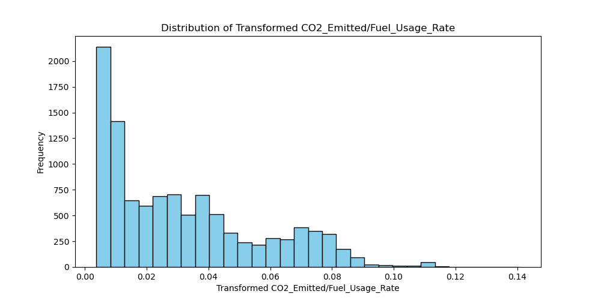
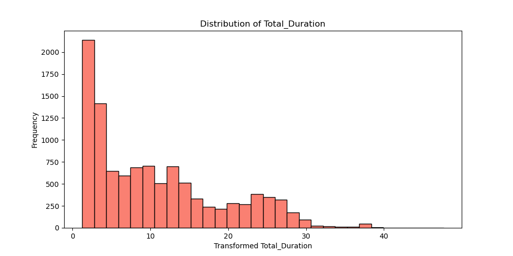

# Decision Tree Analysis

This section is dedicated to decision tree analysis. Because the dependent variable is not categorical, the DecisionTreeRegressor from scikit-learn was employed. 
After the first decision tree was created, using the original dataset (with Duration_hours and Duration_min combined into a single variable Total_Duration), the $R^2$ value was 0.999977. This value seemed suspuciously perfect. 
The effect of the high correlation value can also be seen in the figure below, which is a plot of the actual vs predicted value, and as can be seen the predicted values fall almost perfectly along the actual values.

  
   
  <strong>Figure 7:</strong> Correlation matrix created using the original dataset.

To understand the origins of this $R^2$ value, firstly, a correlation plot was created. The first correlation plot is seen below in Figure 8:

  
   
  <strong>Figure 8:</strong> Correlation matrix created using the original dataset.

As can be seen from the figure above, the highest correlation appears between Total_Duration and CO2_Emitted (US Ton), the depenent variable. This makes sense, of course, because the longer the plane is in flight, the more $CO_2$ will be emitted. 

In order to question this highly suspicious result, we divided the origianl dependent variable, CO2_Emitted (US Ton), by Total_Duration to create a new dependent variable called CO2_Emitted/Hour. Now we notice the appearance of two clusters, which indicates that there must be a variable(s) that is causing a binomial distribution. 

  
   
  <strong>Figure 9:</strong> Actual vs predicted values using CO2_Emitted per Hour as a dependent variable.

To figure out what variable could be causing this binomial distribution, we used RandomForestRegression from scikit-learn to see which features were the most important.

  
   
  <strong>Figure 10:</strong> Most important features using CO2_Emitted per Hour as a dependent variable.

We see that the fleet, Boeing 737 is the most important feature when using CO2_Emitted per Hour as a dependent variable. Originally, we removed this variable to create the first correlation plot since it is a binary variable (its counterpart is Airbus242). However, we see, thanks to Figure 10, that it would be important to bring the Fleet variable back because it is causing the binomial distribution seen in Figure 9.

  
   
  <strong>Figure 11:</strong> Correlation matrix created using CO2_Emitted per Hour as a dependent variable.

Note the appearance of binomial data

  
   
  <strong>Figure 12:</strong> DISTRIBUTION using CO2_Emitted/Hour as a dependent variable.

  
   
  <strong>Figure 13:</strong> Most important features using CO2_Emitted per Fuel Usage as a dependent variable.

Figure 13 shows us that when we use CO2_Emitted per Fuel Usage as a dependent variable, we once again see that the most important feature is Total_Duration, so clearly Total_Duration and Fuel_Usage_Rate are variables that greatly affect the dependent variable.

  
   
  <strong>Figure 14:</strong> Actual vs predicted values using CO2_Emitted/Fuel_Usage_Rate as a dependent variable.

  
   
  <strong>Figure 15:</strong> Correlation matrix created using CO2_Emitted/Fuel_Usage_Rate as a dependent variable.

Note the appearance of binomial data

  
   
  <strong>Figure 16:</strong> DISTRIBUTION of Fuel_Usage_Rate.

Data mimickry noting that Total_Duration and Fuel_Consumption_Rate are most influential independent variables

  
   
  <strong>Figure 17:</strong> DISTRIBUTION using CO2_Emitted/Hour as a dependent variable.

  
   
  <strong>Figure 18:</strong> DISTRIBUTION of Total_Duration.

