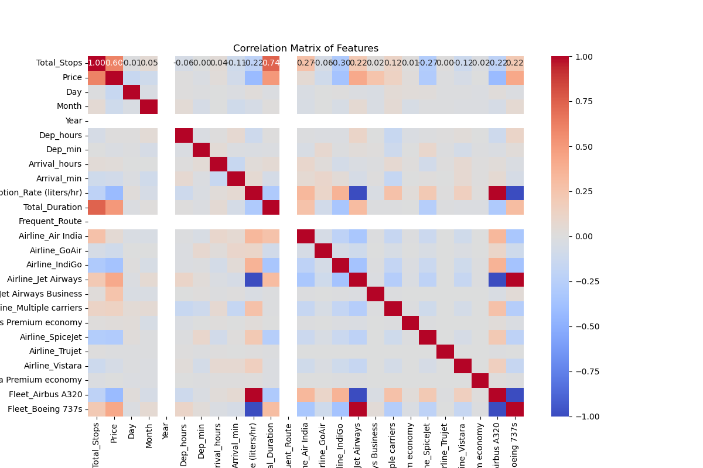

# Implementing Decision Tree Regressor Model for CO_2 Emission Prediction
In this subsequent section, because the dependent variable is numerical and not categorical, we implemented a regression tree rather than a decision tree. 
We began with processing the independent variables that were categorical by using one-hot-encoding, as we did for the Fleet and Airline variables, and by creating a binary variable, as we did for Frequent_Route where city names received a 1 if they appear in Table 2 and a 0 if they do not.
Once the data was processes satisfactorily, the dataset was divided into 80% for training and 20% for testing, and the regression tree was created. However, the $R^2$ value was suspicioulsly close to perfect with a value of 0.9999. To target this, we firstly analysed a correlation plot, which is shown in the figure below.

  
   
  <strong>Figure 6:</strong> Correlation plot for all independent variables.

From the correlation plot above, one can note that several of the independent variables are correlated. This is likely causing multicollinearity, which accounts for the suspiciously high $R^2$ value.  
