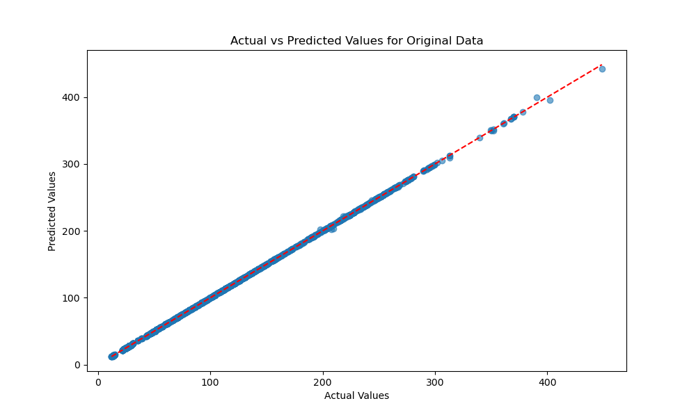
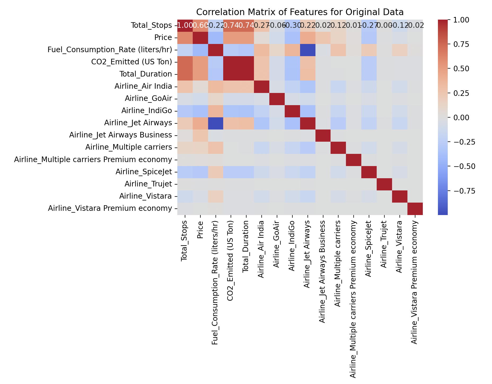

# Decision Tree Analysis

This section is dedicated to decision tree analysis. Because the dependent variable is not categorical, the DecisionTreeRegressor from scikit-learn was employed. 
After the first decision tree was created, using the original dataset (with Duration_hours and Duration_min combined into a single variable Total_Duration), the \( R^2 \) value was 0.999977. This value seemed suspuciously perfect. 
The effect of the high correlation value can also be seen in the figure below, which is a plot of the actual vs predicted value, and as can be seen the predicted values fall almost perfectly along the actual values.

  
   
  <strong>Figure 7:</strong> Correlation matrix created using the original dataset.

To understand the origins of this \( R^2 \) value, firstly a correlation plot was created. The first correlation plot is seen below in Figure 8:

  
   
  <strong>Figure 8:</strong> Correlation matrix created using the original dataset.

As can be seen from the figure above, the highest correlation appears between Total_Duration and CO2_Emitted (US Ton), the depenent variable. This makes sense, of course, because the longer the plane is in flight, the more \( CO_2 \) will be emitted. 
