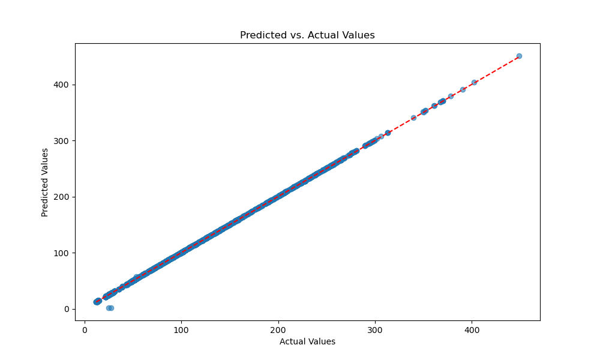

# Neural Network Analysis

This section explains the output of the neural network model created for this project. For the neural network model development, tensorflow, Sequential from tensorflow.keras.models, Dense from tensorflow.keras.layers, and Adam from tensorflow.keras.optimizers were employed.
The MSE returned from running the model was 7.91x10-5. This MSE value is suspiciously low, and just as in the previous section, "Decision Tree Analysis", the graphs created from the model analysis also indicate a near-perfect correlation between the model and the actual values. These findings once again point towards the possibility of the data being artificially designed, leading to very low variability.
Below is a graph showing the relationship between the training and testing data, and it is easy to see that the training loss almost perfectly mirrors the validation loss.

  
   
  <strong>Figure 24:</strong> Training vs validation plot

The following graphs also provide evidence for the possibility that the data was fabricated rather than collected in the real world. In Figure 18 below, we see how, except for just two data points, all predicted values lie almost perfectly along the line representing the actual values. This is a similar graph to Figures 14 and 22 from this project's portion called "Decision Tree Analysis".

  
   
  <strong>Figure 25:</strong> Predicted vs actual values plot

Lastly, as with Figure 25, Figure 26 shows just two outliers while the rest of the data points lie on the line representing the 0 residual value. Residuals are the output of the subtraction between predicted and actual values, and they show how far the predicted values are from the actual ones. The fact that almost all the points are so close to 0 would indicate that there is almost no error between predicted and actual values. This outcome is very unlikely to happen in data with a normal amout of variability, which once again points to the conclusion that the data may have been artificially created.

  
   
  <strong>Figure 26:</strong> Residual plot

