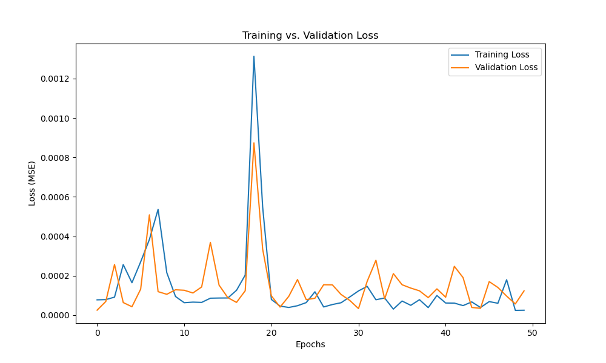

# Neural Network Analysis

This section explains the output of the neural network model created for this project. For the neural network model development, tensorflow, Sequential from tensorflow.keras.models, Dense from tensorflow.keras.layers, and Adam from tensorflow.keras.optimizers were employed.
The MSE returned from running the model was $7.919958*(1/10^5)$. This MSE value is suspiciously low, and, just as in the previous section "Decision Tree Analysis", the graphs created from the model analysis also indicate a near-perfect correlation between the model and the actual values. These findings once again point towards the possibility of the data being artificially designed, leading to very low variability.
Below is a graph showing the correlation between the training and testing data.

  
   
  <strong>Figure 17:</strong> Training vs validation plot

