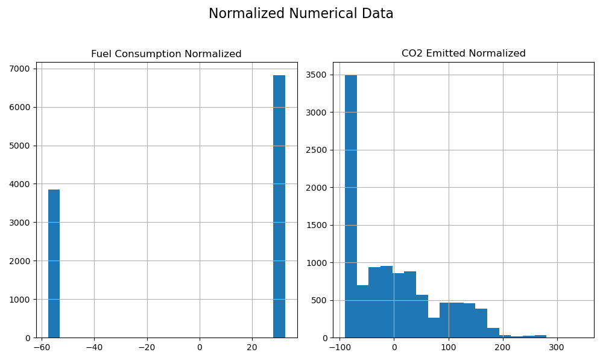
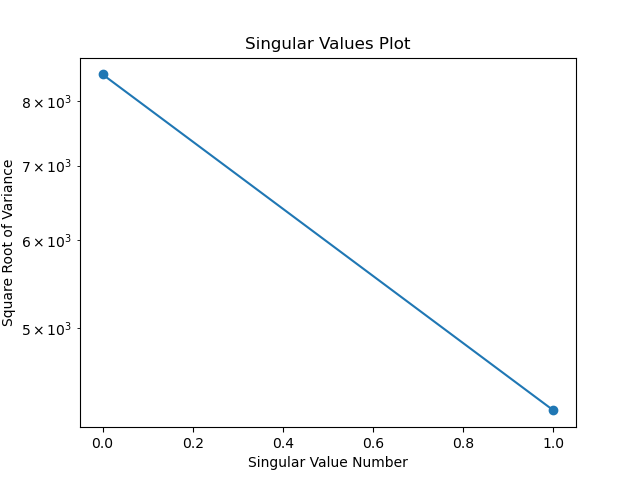
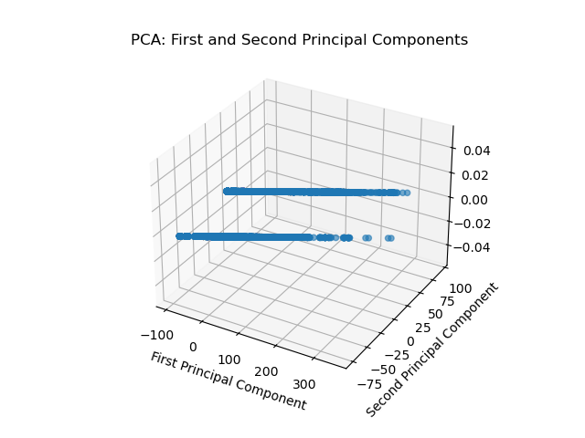

---
title: Flight Price Predictions
keywords:
- Flight Price
- Prediction Model
- Future Trends
- Emissions
- Data Analysis
lang: en-US
date-meta: '2024-10-23'
author-meta:
- Shayan Bafandkar
- Sofia Frenk
- Supreme Pandey
- Brandy Diggs-McGee
header-includes: |
  <!--
  Manubot generated metadata rendered from header-includes-template.html.
  Suggest improvements at https://github.com/manubot/manubot/blob/main/manubot/process/header-includes-template.html
  -->
  <meta name="dc.format" content="text/html" />
  <meta property="og:type" content="article" />
  <meta name="dc.title" content="Flight Price Predictions" />
  <meta name="citation_title" content="Flight Price Predictions" />
  <meta property="og:title" content="Flight Price Predictions" />
  <meta property="twitter:title" content="Flight Price Predictions" />
  <meta name="dc.date" content="2024-10-23" />
  <meta name="citation_publication_date" content="2024-10-23" />
  <meta property="article:published_time" content="2024-10-23" />
  <meta name="dc.modified" content="2024-10-23T05:09:48+00:00" />
  <meta property="article:modified_time" content="2024-10-23T05:09:48+00:00" />
  <meta name="dc.language" content="en-US" />
  <meta name="citation_language" content="en-US" />
  <meta name="dc.relation.ispartof" content="Manubot" />
  <meta name="dc.publisher" content="Manubot" />
  <meta name="citation_journal_title" content="Manubot" />
  <meta name="citation_technical_report_institution" content="Manubot" />
  <meta name="citation_author" content="Shayan Bafandkar" />
  <meta name="citation_author_institution" content="Department of Civil &amp; Environmental Engineering, University of Illinois Urbana-Champaign" />
  <meta name="citation_author_orcid" content="0009-0009-8172-5751" />
  <meta name="citation_author" content="Sofia Frenk" />
  <meta name="citation_author_institution" content="Department of Civil &amp; Environmental Engineering, University of Illinois Urbana-Champaign" />
  <meta name="citation_author_orcid" content="0009-0001-8099-4900" />
  <meta name="citation_author" content="Supreme Pandey" />
  <meta name="citation_author_institution" content="Department of Civil and Environmental Engineering, University of illinois Urbana-Champaign" />
  <meta name="citation_author_orcid" content="0000-0003-0775-6313" />
  <meta name="citation_author" content="Brandy Diggs-McGee" />
  <meta name="citation_author_institution" content="Department of Civil &amp; Environmental Engineering, University of Illinois Urbana-Champaign" />
  <meta name="citation_author_institution" content="USACE ERDC CERL, Illinois" />
  <meta name="citation_author_orcid" content="0000-0003-2052-0946" />
  <link rel="canonical" href="https://uiceds.github.io/project-triples/" />
  <meta property="og:url" content="https://uiceds.github.io/project-triples/" />
  <meta property="twitter:url" content="https://uiceds.github.io/project-triples/" />
  <meta name="citation_fulltext_html_url" content="https://uiceds.github.io/project-triples/" />
  <meta name="citation_pdf_url" content="https://uiceds.github.io/project-triples/manuscript.pdf" />
  <link rel="alternate" type="application/pdf" href="https://uiceds.github.io/project-triples/manuscript.pdf" />
  <link rel="alternate" type="text/html" href="https://uiceds.github.io/project-triples/v/276134bc2010523d309de82563c173d242583ecc/" />
  <meta name="manubot_html_url_versioned" content="https://uiceds.github.io/project-triples/v/276134bc2010523d309de82563c173d242583ecc/" />
  <meta name="manubot_pdf_url_versioned" content="https://uiceds.github.io/project-triples/v/276134bc2010523d309de82563c173d242583ecc/manuscript.pdf" />
  <meta property="og:type" content="article" />
  <meta property="twitter:card" content="summary_large_image" />
  <link rel="icon" type="image/png" sizes="192x192" href="https://manubot.org/favicon-192x192.png" />
  <link rel="mask-icon" href="https://manubot.org/safari-pinned-tab.svg" color="#ad1457" />
  <meta name="theme-color" content="#ad1457" />
  <!-- end Manubot generated metadata -->
bibliography:
- content/manual-references.json
manubot-output-bibliography: output/references.json
manubot-output-citekeys: output/citations.tsv
manubot-requests-cache-path: ci/cache/requests-cache
manubot-clear-requests-cache: false
...

<small><em>
This manuscript
([permalink](https://uiceds.github.io/project-triples/v/276134bc2010523d309de82563c173d242583ecc/))
was automatically generated
from [uiceds/project-triples@276134b](https://github.com/uiceds/project-triples/tree/276134bc2010523d309de82563c173d242583ecc)
on October 23, 2024.
</em></small>

## Authors

+ **Shayan Bafandkar**
   
    {.inline_icon width=16 height=16}
    [0009-0009-8172-5751](https://orcid.org/0009-0009-8172-5751)
    · {.inline_icon width=16 height=16}
    [sbafan](https://github.com/sbafan)
     
  <small>
     Department of Civil & Environmental Engineering, University of Illinois Urbana-Champaign
  </small>

+ **Sofia Frenk**
  ^[✉](#correspondence)^ 
    {.inline_icon width=16 height=16}
    [0009-0001-8099-4900](https://orcid.org/0009-0001-8099-4900)
    · {.inline_icon width=16 height=16}
    [sofia-frenk](https://github.com/sofia-frenk)
     
  <small>
     Department of Civil & Environmental Engineering, University of Illinois Urbana-Champaign
  </small>

+ **Supreme Pandey**
   
    {.inline_icon width=16 height=16}
    [0000-0003-0775-6313](https://orcid.org/0000-0003-0775-6313)
    · {.inline_icon width=16 height=16}
    [supremepandey](https://github.com/supremepandey)
     
  <small>
     Department of Civil and Environmental Engineering, University of illinois Urbana-Champaign
  </small>

+ **Brandy Diggs-McGee**
   
    {.inline_icon width=16 height=16}
    [0000-0003-2052-0946](https://orcid.org/0000-0003-2052-0946)
    · {.inline_icon width=16 height=16}
    [iloveheat](https://github.com/iloveheat)
     
  <small>
     Department of Civil & Environmental Engineering, University of Illinois Urbana-Champaign; USACE ERDC CERL, Illinois
  </small>

::: {#correspondence}
✉ — Correspondence possible via [GitHub Issues](https://github.com/uiceds/project-triples/issues)
or email to
Sofia Frenk \<sofiaf6@illinois.edu\>.

:::

## Abstract
The primary goal of our project is to build a machine learning model that can estimate changes in future flight prices based on historical data by using regression techniques. We will investigate how factors such as time of departure, number of stops, and the choice of airline influence flight prices. The secondary objective is to analyze if certain trends can be linked to broader environmental, economic and/or policy factors.
The dataset includes columns for departure and destination locations, total stops, travel duration, and price information. The model will be trained using machine learning techniques, with a focus on determining which features contribute most to price variations. 
The aviation industry is a critical component of the global transportation network, impacting not only the economy but also the environment due to its significant carbon footprint. By developing accurate flight price prediction models, we can contribute to better planning and optimization of air travel routes, which is essential for both transportation engineering and environmental sustainability. If airlines and passengers can anticipate future price trends, it enables more efficient scheduling, potentially increasing the efficiency of flight operation and possibly minimizing unnecessary emissions.

## Proposal
Our team plans to use a Kaggle flight prediction dataset to develop a machine learning model in Julia that predicts future flight prices for domestic routes in India. The primary goal is to build a machine learning model that can estimate changes in future flight prices based on historical data, using regression techniques. We will investigate how factors such as time of departure, number of stops, the choice of airline, among others, influence flight prices. The secondary objective is to analyze if certain trends can be linked to broader environmental or policy factors.
While predicting flight prices may seem primarily economic, it intersects with transportation engineering by optimizing air traffic and scheduling. Additionally, these predictions could indirectly inform decisions aimed at reducing the environmental impact of flights. By better understanding pricing trends, stakeholders can implement dynamic pricing strategies that encourage sustainable travel, such as offering discounts for off-peak flights or promoting direct routes to cut down on fuel consumption.

## Dataset Description 
  - Source: 
  The dataset used for this project can be found on Kaggle, at this link: https://www.kaggle.com/datasets/viveksharmar/flight-price-data
  It was used to help build a predictive model for flight price prediction using the data that will be explained below.
  - Format: The dataset is in CSV format, which is commonly used for tabular data storage. Each row represents a specific data point, with columns detailing various features that might impact flight prices.
  - Contents: 
    The dataset serves as a basis for training machine learning models for predicion of flight costs.
    More specifically, the dataset includes the following columns:
    1) Airline: A String value representing the name of the Indian airline company included in the study
    2) Source: Another String value representing the city from which the airline departs
    3) Destination: Yet another String value representing the arrival city
    4) Total_Stops: a ternary integer variable between 0 and 2 that represents the number of of stopd from the city of departure to the arrival
    5) Price: An integer variable presententing the cost, in rupees, for each ticket
    6) Day/Month/Year: Three columns containing integer variables representing the date when the flight took place. Note that the year column contains only the year 2019, so we may remove this column
    7) Dep_hours/Dep_min: Two columns containing integer numbers representing the hour, in military time, and minute at which the flight departed
    8) Arrival_hours/Arrival_min: Similar to the Dep_hours/Dep_min columns, but for the the arrival time of the flight
    9) Duration_hours/Duration_min: Two columns with integer values representing the number of hours and minuted a flight lasted

## Introduction
_The dynamics of flight price predictions_

Flight pricing models have long been of interest to researchers, airline companies, and consumers alike [@sun2024airline]. As global air travel expands, so do the complexities involved in predicting flight prices due to the dynamic nature of factors such as fuel costs, demand fluctuations, and the regulatory environment [@sun2024airline; @belobaba2015global; @international2019economic; @borenstein1994competition]. Predicting flight prices accurately allows both passengers and airlines to optimize travel schedules, with potential economic and environmental benefits [@belobaba2015global]. In recent years, machine learning techniques have been widely adopted in various industries, including aviation, to model complex relationships and predict outcomes such as pricing [@sherly2023machine; @kalampokas2023holistic; @xu2021influential]. For this project, we propose a machine learning-based predictive model designed to estimate future flight prices based on historical data from domestic flight routes to and from India.

_The importance of predicting flight prices_

Accurately predicting flight prices has significant implications for multiple stakeholders. For consumers, anticipating price trends helps optimize travel costs, allowing for better budgeting and planning [@international2019economic; @borenstein1994competition; @gillen2005economics]. Airlines, on the other hand, can improve their revenue management strategies through dynamic pricing, ensuring that flights operate closer to capacity while adjusting pricing to meet seasonal demand shifts and market competition [@belobaba2015global; @borenstein1994competition; @gillen2005economics]. Additionally, by integrating environmental factors such as carbon emissions into the pricing model, this research can help airlines design more sustainable routes, potentially leading to fewer emissions through better traffic management and efficient flight operations [@sun2024airline; @international2019economic; @gillen2005economics; @xiong2023aviation]. The aviation industry contributes significantly to the global economy but also poses challenges due to its substantial carbon footprint [@brueckner2017airline].

_Methodological approach and dataset_

This project utilizes a Kaggle dataset on domestic flights in India, covering variables such as airline name, total stops, departure and destination locations, and flight prices [3–5, 8]. Using regression techniques within a machine learning framework, the researchers aim to identify which variables most significantly impact flight prices. Initial findings suggest that factors such as the number of stops, flight duration, and seasonal demand (correlating with major holidays in India) are key drivers of price variation. For instance, a notable spike in flight prices is observed around holidays in India, are insights that not only advance knowledge in transportation economics but also serve as a crucial decision-making tool for airline pricing strategies [@sun2024airline; @international2019economic; @borenstein1994competition; @gillen2005economics]. 

_Multidisciplinary implications_

By developing this predictive model, the research bridges the gap between economics, machine learning, and environmental sustainability. Future applications of this work could extend beyond pricing into areas like route optimization and emission reduction strategies [@international2019economic]. As flight prices are a key variable in both economic and environmental calculations, understanding their underlying dynamics can contribute to more sustainable and cost-effective air travel in the future [@belobaba2015global; @international2019economic; @gillen2005economics].

## Exploratory Data Analysis of Indian Domestic Flights (March - June 2019)

The dataset includes domestic flights of Indian airlines from March 2019 to June 2019, and is derived from [Kaggle](https://www.kaggle.com/datasets/viveksharmar/flight-price-data/). Each column in the dataset corresponds to a specific variable, and each row represents an observation. The dataset is clean, with consistent measurement units and no missing values.

### Dataset Variables:
- **Airlines**: The name of the airline operating the flight.
- **Source and Destination**: Cities where the flights originate and land.
- **Total Stops**: The number of stops made by the flight.
- **Price**: The ticket price for the respective flight.
- **Date, Month, and Year**: The specific date on which the flight is scheduled.
- **Departure and Arrival Times**: Detailed departure and arrival hours and minutes.
- **Duration**: The total duration of the flight in hours and minutes.

### Correlation Analysis:
We explored possible correlations between variables in the dataset. One expected correlation is between flight price and flight duration. Using the `cor` function in Julia, we found a positive correlation of **0.51** between these two variables. Similarly, the correlation between the number of stops and price is **0.60**. It makes sense that as the number of stops increases, the flight distance and, consequently, the price also increase.

The chart depicted in **Figure 1** illustrates that most flights in the dataset have ticket prices below 10,000 Rupees.

  
   
  <strong>Figure 1:</strong> Distribution of Flight Prices (Positive Skew).

### Seasonal Price Variations:
To analyze seasonal price variations, we created a new column, `Adjusted-Date`, by combining the values from the `Date`, `Month`, and `Year` columns into a single date format. We then plotted the mean price over time using this adjusted date.
As shown in **Figure 2**, flight prices fluctuate significantly over time, with notable peaks around the major Indian holidays.

  
   
  <strong>Figure 2:</strong> Flight price trends over time.

These price variations can be correlated with the seasonal demand and cultural events during this period. Upon reviewing the price fluctuations, we explored the major holidays in India during this period to identify possible correlations between price peaks and holidays. Interestingly, many of the price peaks align with Indian holidays. For example:
- In March, price spikes around March 4th and 21st coincide with **Maha Shivaratri** and **Holi**, respectively.
- In April, a price increase occurs around April 13th and 14th, aligning with **Ram Navami**, **Baisakhi**, and **Tamil New Year/Vishu**.
- In May, a price increase is observed around May 1st (coinciding with **May Day**) and May 18th (coinciding with **Buddha Purnima**).
- High prices persist into early June, corresponding with **Eid-ul-Fitr** (June 4th) and **Ganga Dussehra** (June 12th).

### Destination Analysis:
We reviewed **10,684** flights during this period. **Cochin**, **Bangalore**, and **Delhi** were the top destinations, with Cochin being the most attractive, receiving the highest number of flights. The details of the top destinations are shown in **Table 1**.

**Table 1: Top Flight Destinations**

| Rank | Destination | Count |
|------|-------------|-------|
| 1    | Cochin      | 4,537 |
| 2    | Bangalore   | 2,871 |
| 3    | Delhi       | 1,265 |
| 4    | New Delhi   | 932   |
| 5    | Hyderabad   | 697   |
| 6    | Kolkata     | 381   |

### Origin-Destination (O/D) Pair Analysis:
We also identified the most frequent origin-destination pairs, as shown in **Table 2**.

**Table 2: Most Frequent Origin-Destination Pairs**

| Rank | Source   | Destination | Count |
|------|----------|-------------|-------|
| 1    | Delhi    | Cochin      | 4,537 |
| 2    | Kolkata  | Bangalore   | 2,871 |
| 3    | Bangalore| Delhi       | 1,265 |
| 4    | Bangalore| New Delhi   | 932   |
| 5    | Mumbai   | Hyderabad   | 697   |
| 6    | Chennai  | Kolkata     | 381   |

### Airline Insights:
Our analysis of the airlines provided the following insights:

#### 1. Mean Price by Airline:
The table below (**Table 3**) shows the mean flight price for each airline, sorted from highest to lowest.

**Table 3: Mean Price by Airline**

| Rank | Airline                      | Mean Price (INR) |
|------|------------------------------|------------------|
| 1    | Jet Airways Business          | 58,359           |
| 2    | Jet Airways                   | 11,644           |
| 3    | Multiple Carriers Premium     | 11,419           |
| 4    | Multiple Carriers             | 10,903           |
| 5    | Air India                     | 9,611            |
| 6    | Vistara Premium Economy       | 8,962            |
| 7    | Vistara                       | 7,796            |
| 8    | GoAir                         | 5,861            |
| 9    | IndiGo                        | 5,674            |
| 10   | Air Asia                      | 5,590            |
| 11   | SpiceJet                      | 4,338            |
| 12   | Trujet                        | 4,140            |

#### 2. Airlines with the Most Number of Flights:
The table below (**Table 4**) lists the airlines with the most flights in the dataset.

**Table 4: Airlines with the Most Number of Flights**

| Rank | Airline                      | Number of Flights |
|------|------------------------------|-------------------|
| 1    | Jet Airways                   | 3,849             |
| 2    | IndiGo                        | 2,053             |
| 3    | Air India                     | 1,752             |
| 4    | Multiple Carriers             | 1,196             |
| 5    | SpiceJet                      | 818               |
| 6    | Vistara                       | 479               |
| 7    | Air Asia                      | 319               |
| 8    | GoAir                         | 194               |
| 9    | Multiple Carriers Premium     | 13                |
| 10   | Jet Airways Business          | 6                 |
| 11   | Vistara Premium Economy       | 3                 |
| 12   | Trujet                        | 1                 |

#### 3. Airlines Frequently Used in Long-Haul Flights:
The table below (**Table 5**) lists the airlines frequently used for long-haul flights (flights with a duration greater than 10 hours).

**Table 5: Airlines Frequently Used in Long-Haul Flights**

| Rank | Airline                      | Long-Haul Flights |
|------|------------------------------|-------------------|
| 1    | Jet Airways                   | 2,395             |
| 2    | Air India                     | 1,178             |
| 3    | Multiple Carriers             | 625               |
| 4    | IndiGo                        | 231               |
| 5    | Vistara                       | 197               |

It is worth noting that there is limited data available for multiple-carrier flights, so further analysis of these flights is not possible.

### Singular Value Decomposition (SVD) and Principal Components Analysis (PCA):

Before beginning with SVD or even PCA, we must normalize the data. Since most of out variables are categorical, only two variables needed to be normalized. These two variables are Fuel_Consumption_normalized and CO2_Emitted_normalized, and their normalization values are shown in the bar chart below, in **Figure 3**. This provided a preview that perhaps SVD and PCA would not be needed, given the small number of numerical variables. 

  
   
  <strong>Figure 3:</strong> Bar chat showing the normalization of our two numerical variables.

Since there are only two numerical variables to be analysed in this dataset, only two singular values were created, as can be seen below in **Figure 4**.

  
   
  <strong>Figure 4:</strong> Line plot with two points representing two singular values.

As we only have 2 numerical variables, it makes sense that most of the data points are concentrated around the first and second principal components, because they correspond to the two numerical variables. This can be seen below in **Figure 5**. Of course, there are the only two principal components. Because we have such few numerical variables, if we were to use PCA, we might lose valuable information. Hence, we will proceed with regression analysis in the next section of our project. 

  
   
  <strong>Figure 5:</strong> First and second principal components.

## Predictive model planning

This project's goal is to build a Machine learning-based predictive model. Linear regression will be used to establish the relationship between the datasets' features and prices. Gradient boosting algorithm of XGBoost Regressor or/and Random Forest Regressor will be used for capturing complex patterns and the predictive tasks. In the case of non-linearity and high interactions PCA or/and neural network will be used to enhance the performance. To measure the difference between actual and predicted prices, RMSE (Root Mean Square Error) or MSE(Mean Square Error) will be used. R-Squared (R2- Coefficient of determination – measure of goodness-of-fit of regression) will evaluate how well independent variable explains the variance in the flight prices. While building this model, we will be working with the packages such as DataFrame.jl, StatsPlots.jl, Statistics.jl, MLJ.jl, etc. from Julia library. If needed, ScikitLearn.jl (access to python's Scikit-learn models in julia) will be implemented.

Our model will be able to predict the seasonal spikes in flight prices because of the factors such as festivals, holidays or high demand periods so that airlines can adjust the pricing and offer more competitive pricing. Additionally, Expensive (with higher mean ticket prices) airlines can be benefited by understanding the price elasticity and regulating accordingly. Furthermore, we can explore the environmental sustainability factors such as carbon emission by adopting environmentally sustainable options like fewer layover routes, energy efficient airlines, etc.

## References {.page_break_before}

<!-- Explicitly insert bibliography here -->

