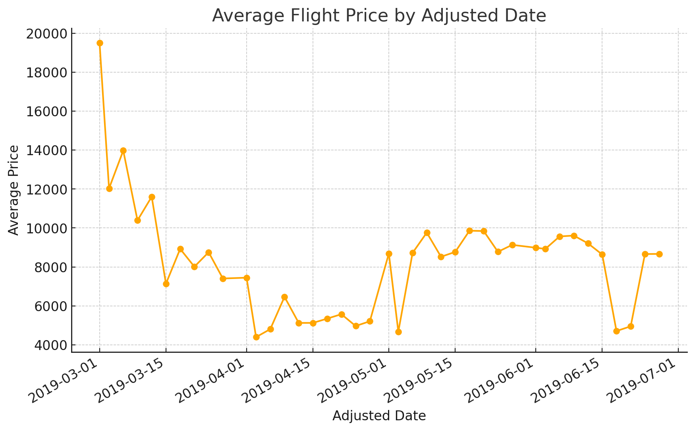
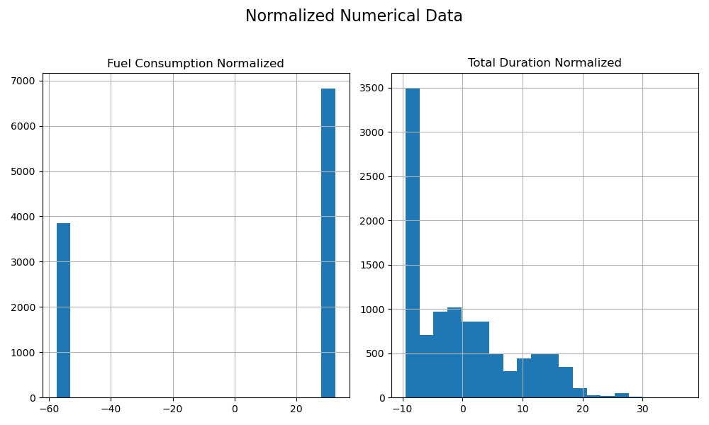
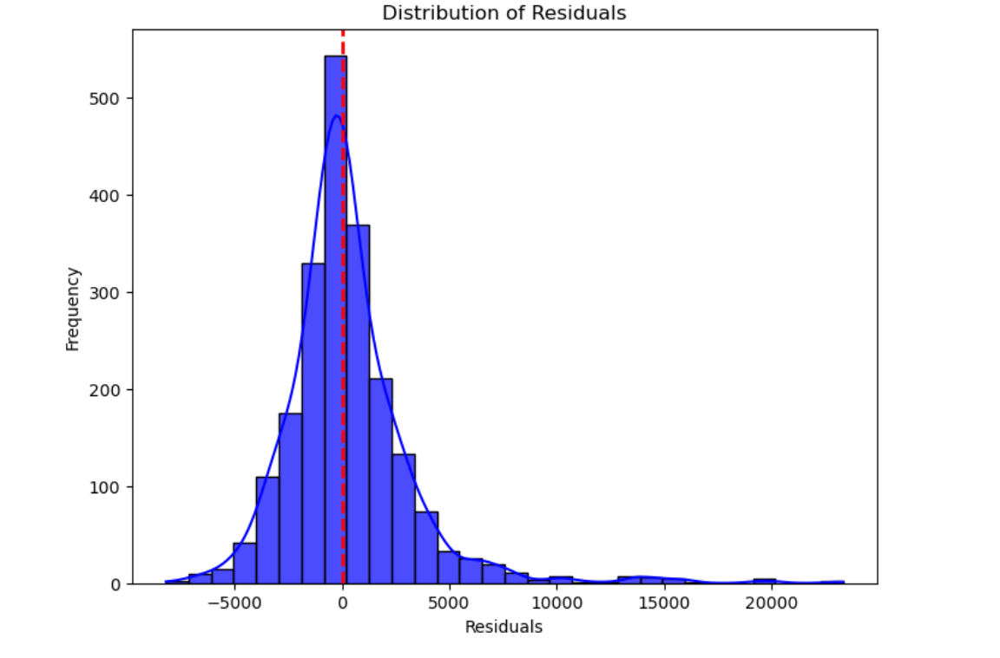
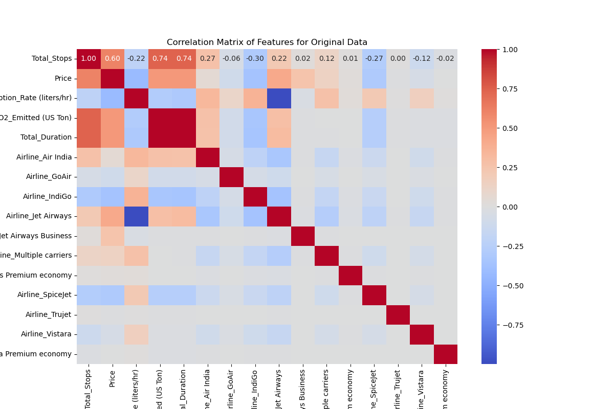
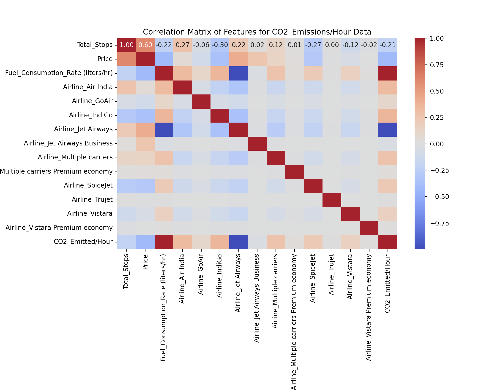

---
title: Flight Price Predictions
keywords:
- Flight Price
- Prediction Model
- Future Trends
- Emissions
- Data Analysis
lang: en-US
date-meta: '2024-11-26'
author-meta:
- Shayan Bafandkar
- Sofia Frenk
- Supreme Pandey
- Brandy Diggs-McGee
header-includes: |
  <!--
  Manubot generated metadata rendered from header-includes-template.html.
  Suggest improvements at https://github.com/manubot/manubot/blob/main/manubot/process/header-includes-template.html
  -->
  <meta name="dc.format" content="text/html" />
  <meta property="og:type" content="article" />
  <meta name="dc.title" content="Flight Price Predictions" />
  <meta name="citation_title" content="Flight Price Predictions" />
  <meta property="og:title" content="Flight Price Predictions" />
  <meta property="twitter:title" content="Flight Price Predictions" />
  <meta name="dc.date" content="2024-11-26" />
  <meta name="citation_publication_date" content="2024-11-26" />
  <meta property="article:published_time" content="2024-11-26" />
  <meta name="dc.modified" content="2024-11-26T05:48:43+00:00" />
  <meta property="article:modified_time" content="2024-11-26T05:48:43+00:00" />
  <meta name="dc.language" content="en-US" />
  <meta name="citation_language" content="en-US" />
  <meta name="dc.relation.ispartof" content="Manubot" />
  <meta name="dc.publisher" content="Manubot" />
  <meta name="citation_journal_title" content="Manubot" />
  <meta name="citation_technical_report_institution" content="Manubot" />
  <meta name="citation_author" content="Shayan Bafandkar" />
  <meta name="citation_author_institution" content="Department of Civil &amp; Environmental Engineering, University of Illinois Urbana-Champaign" />
  <meta name="citation_author_orcid" content="0009-0009-8172-5751" />
  <meta name="citation_author" content="Sofia Frenk" />
  <meta name="citation_author_institution" content="Department of Civil &amp; Environmental Engineering, University of Illinois Urbana-Champaign" />
  <meta name="citation_author_orcid" content="0009-0001-8099-4900" />
  <meta name="citation_author" content="Supreme Pandey" />
  <meta name="citation_author_institution" content="Department of Civil and Environmental Engineering, University of illinois Urbana-Champaign" />
  <meta name="citation_author_orcid" content="0000-0003-0775-6313" />
  <meta name="citation_author" content="Brandy Diggs-McGee" />
  <meta name="citation_author_institution" content="Department of Civil &amp; Environmental Engineering, University of Illinois Urbana-Champaign" />
  <meta name="citation_author_institution" content="USACE ERDC CERL, Illinois" />
  <meta name="citation_author_orcid" content="0000-0003-2052-0946" />
  <link rel="canonical" href="https://uiceds.github.io/project-triples/" />
  <meta property="og:url" content="https://uiceds.github.io/project-triples/" />
  <meta property="twitter:url" content="https://uiceds.github.io/project-triples/" />
  <meta name="citation_fulltext_html_url" content="https://uiceds.github.io/project-triples/" />
  <meta name="citation_pdf_url" content="https://uiceds.github.io/project-triples/manuscript.pdf" />
  <link rel="alternate" type="application/pdf" href="https://uiceds.github.io/project-triples/manuscript.pdf" />
  <link rel="alternate" type="text/html" href="https://uiceds.github.io/project-triples/v/2c23dae2f6b770165693839a68e7e8db54aa6b6a/" />
  <meta name="manubot_html_url_versioned" content="https://uiceds.github.io/project-triples/v/2c23dae2f6b770165693839a68e7e8db54aa6b6a/" />
  <meta name="manubot_pdf_url_versioned" content="https://uiceds.github.io/project-triples/v/2c23dae2f6b770165693839a68e7e8db54aa6b6a/manuscript.pdf" />
  <meta property="og:type" content="article" />
  <meta property="twitter:card" content="summary_large_image" />
  <link rel="icon" type="image/png" sizes="192x192" href="https://manubot.org/favicon-192x192.png" />
  <link rel="mask-icon" href="https://manubot.org/safari-pinned-tab.svg" color="#ad1457" />
  <meta name="theme-color" content="#ad1457" />
  <!-- end Manubot generated metadata -->
bibliography: []
manubot-output-bibliography: output/references.json
manubot-output-citekeys: output/citations.tsv
manubot-requests-cache-path: ci/cache/requests-cache
manubot-clear-requests-cache: false
...

<small><em>
This manuscript
([permalink](https://uiceds.github.io/project-triples/v/2c23dae2f6b770165693839a68e7e8db54aa6b6a/))
was automatically generated
from [uiceds/project-triples@2c23dae](https://github.com/uiceds/project-triples/tree/2c23dae2f6b770165693839a68e7e8db54aa6b6a)
on November 26, 2024.
</em></small>

## Authors

+ **Shayan Bafandkar**
   
    {.inline_icon width=16 height=16}
    [0009-0009-8172-5751](https://orcid.org/0009-0009-8172-5751)
    · {.inline_icon width=16 height=16}
    [sbafan](https://github.com/sbafan)
     
  <small>
     Department of Civil & Environmental Engineering, University of Illinois Urbana-Champaign
  </small>

+ **Sofia Frenk**
  ^[✉](#correspondence)^ 
    {.inline_icon width=16 height=16}
    [0009-0001-8099-4900](https://orcid.org/0009-0001-8099-4900)
    · {.inline_icon width=16 height=16}
    [sofia-frenk](https://github.com/sofia-frenk)
     
  <small>
     Department of Civil & Environmental Engineering, University of Illinois Urbana-Champaign
  </small>

+ **Supreme Pandey**
   
    {.inline_icon width=16 height=16}
    [0000-0003-0775-6313](https://orcid.org/0000-0003-0775-6313)
    · {.inline_icon width=16 height=16}
    [supremepandey](https://github.com/supremepandey)
     
  <small>
     Department of Civil and Environmental Engineering, University of illinois Urbana-Champaign
  </small>

+ **Brandy Diggs-McGee**
   
    {.inline_icon width=16 height=16}
    [0000-0003-2052-0946](https://orcid.org/0000-0003-2052-0946)
    · {.inline_icon width=16 height=16}
    [iloveheat](https://github.com/iloveheat)
     
  <small>
     Department of Civil & Environmental Engineering, University of Illinois Urbana-Champaign; USACE ERDC CERL, Illinois
  </small>

::: {#correspondence}
✉ — Correspondence possible via [GitHub Issues](https://github.com/uiceds/project-triples/issues)
or email to
Sofia Frenk \<sofiaf6@illinois.edu\>.

:::

## Abstract
The primary goal of our project is to build a machine learning model that can estimate changes in future flight prices based on historical data by using regression techniques. We will investigate how factors such as time of departure, number of stops, and the choice of airline influence flight prices. The secondary objective is to analyze if certain trends can be linked to broader environmental, economic and/or policy factors.
The dataset includes columns for departure and destination locations, total stops, travel duration, and price information. The model will be trained using machine learning techniques, with a focus on determining which features contribute most to price variations. 
The aviation industry is a critical component of the global transportation network, impacting not only the economy but also the environment due to its significant carbon footprint. By developing accurate flight price prediction models, we can contribute to better planning and optimization of air travel routes, which is essential for both transportation engineering and environmental sustainability. If airlines and passengers can anticipate future price trends, it enables more efficient scheduling, potentially increasing the efficiency of flight operation and possibly minimizing unnecessary emissions.

## Proposal
Our team plans to use a Kaggle flight prediction dataset to develop a machine learning model in Julia that predicts future flight prices for domestic routes in India. The primary goal is to build a machine learning model that can estimate changes in future flight prices based on historical data, using regression techniques. We will investigate how factors such as time of departure, number of stops, the choice of airline, among others, influence flight prices. The secondary objective is to analyze if certain trends can be linked to broader environmental or policy factors.
While predicting flight prices may seem primarily economic, it intersects with transportation engineering by optimizing air traffic and scheduling. Additionally, these predictions could indirectly inform decisions aimed at reducing the environmental impact of flights. By better understanding pricing trends, stakeholders can implement dynamic pricing strategies that encourage sustainable travel, such as offering discounts for off-peak flights or promoting direct routes to cut down on fuel consumption.

## Dataset Description 
  - Source: 
  The dataset used for this project can be found on Kaggle, at this link: [Kaggle](https://www.kaggle.com/datasets/viveksharmar/flight-price-data)
  It was used to help build a predictive model for flight price prediction using the data that will be explained below.
  - Format: The dataset is in CSV format, which is commonly used for tabular data storage. Each row represents a specific data point, with columns detailing various features that might impact flight prices.
  - Contents: 
    The dataset serves as a basis for training machine learning models for predicion of flight costs.
    More specifically, the dataset includes the following columns:
    1) Airline: A String value representing the name of the Indian airline company included in the study
    2) Source: Another String value representing the city from which the airline departs
    3) Destination: Yet another String value representing the arrival city
    4) Total_Stops: a ternary integer variable between 0 and 2 that represents the number of of stopd from the city of departure to the arrival
    5) Price: An integer variable presententing the cost, in rupees, for each ticket
    6) Day/Month/Year: Three columns containing integer variables representing the date when the flight took place. Note that the year column contains only the year 2019, so we may remove this column
    7) Dep_hours/Dep_min: Two columns containing integer numbers representing the hour, in military time, and minute at which the flight departed
    8) Arrival_hours/Arrival_min: Similar to the Dep_hours/Dep_min columns, but for the the arrival time of the flight
    9) Duration_hours/Duration_min: Two columns with integer values representing the number of hours and minuted a flight lasted

## Introduction
_The dynamics of flight price predictions_

Flight pricing models have long been of interest to researchers, airline companies, and consumers alike [Sun et al.](https://doi.org/10.1016/j.jatrs.2024.100013). As global air travel expands, so do the complexities involved in predicting flight prices due to the dynamic nature of factors such as fuel costs, demand fluctuations, and the regulatory environment [Sun et al.](https://doi.org/10.1016/j.jatrs.2024.100013); [Belobaba et al.](https://books.google.com/books?id=BRtDl0CJpQIC); [International Air Transport Association](https://www.iata.org/contentassets/f88f0ceb28b64b7e9b46de44b917b98f/iata-economic-performance-of-the-industry-end-year-2018-report.pdf); [Borenstein et al.](doi.org/10.1086/261950). Predicting flight prices accurately allows both passengers and airlines to optimize travel schedules, with potential economic and environmental benefits [Belobaba et al.](https://books.google.com/books?id=BRtDl0CJpQIC). In recent years, machine learning techniques have been widely adopted in various industries, including aviation, to model complex relationships and predict outcomes such as pricing [Annabel et al.](https://link.springer.com/chapter/10.1007/978-981-19-6634-7_65); [Kalampokas et al.](https://api.semanticscholar.org/CorpusID:258629132); [Xu et al.](https://www.sciencedirect.com/science/article/pii/S0969699720305524?via%3Dihub). For this project, we propose a machine learning-based predictive model designed to estimate future flight prices based on historical data from domestic flight routes to and from India.

_The importance of predicting flight prices_

Accurately predicting flight prices has significant implications for multiple stakeholders. For consumers, anticipating price trends helps optimize travel costs, allowing for better budgeting and planning [International Air Transport Association](https://www.iata.org/contentassets/f88f0ceb28b64b7e9b46de44b917b98f/iata-economic-performance-of-the-industry-end-year-2018-report.pdf); [Borenstein et al.](doi.org/10.1086/261950); [Gillen & Morrison](https://doi.org/10.1016/j.jairtraman.2004.11.003). Airlines, on the other hand, can improve their revenue management strategies through dynamic pricing, ensuring that flights operate closer to capacity while adjusting pricing to meet seasonal demand shifts and market competition [Belobaba et al.](https://books.google.com/books?id=BRtDl0CJpQIC); [Borenstein et al.](doi.org/10.1086/261950); [Gillen & Morrison](https://doi.org/10.1016/j.jairtraman.2004.11.003). Additionally, by integrating environmental factors such as carbon emissions into the pricing model, this research can help airlines design more sustainable routes, potentially leading to fewer emissions through better traffic management and efficient flight operations [Sun et al.](https://doi.org/10.1016/j.jatrs.2024.100013); [International Air Transport Association](https://www.iata.org/contentassets/f88f0ceb28b64b7e9b46de44b917b98f/iata-economic-performance-of-the-industry-end-year-2018-report.pdf); [Gillen & Morrison](https://doi.org/10.1016/j.jairtraman.2004.11.003); [Xiong et al.](doi.org/10.1016/j.jairtraman.2023.102383). The aviation industry contributes significantly to the global economy but also poses challenges due to its substantial carbon footprint [Brueckner et al.](https://www.sciencedirect.com/science/article/pii/S0969699716302976?via%3Dihub).

_Methodological approach and dataset_

This project utilizes a Kaggle dataset on domestic flights in India, covering variables such as airline name, total stops, departure and destination locations, and flight prices [3–5, 8]. Using regression techniques within a machine learning framework, the researchers aim to identify which variables most significantly impact flight prices. Initial findings suggest that factors such as the number of stops, flight duration, and seasonal demand (correlating with major holidays in India) are key drivers of price variation. For instance, a notable spike in flight prices is observed around holidays in India, are insights that not only advance knowledge in transportation economics but also serve as a crucial decision-making tool for airline pricing strategies [Sun et al.](https://doi.org/10.1016/j.jatrs.2024.100013); [International Air Transport Association](https://www.iata.org/contentassets/f88f0ceb28b64b7e9b46de44b917b98f/iata-economic-performance-of-the-industry-end-year-2018-report.pdf); [Borenstein et al.](doi.org/10.1086/261950); [Gillen & Morrison](https://doi.org/10.1016/j.jairtraman.2004.11.003). 

_Multidisciplinary implications_

By developing this predictive model, the research bridges the gap between economics, machine learning, and environmental sustainability. Future applications of this work could extend beyond pricing into areas like route optimization and emission reduction strategies [International Air Transport Association](https://www.iata.org/contentassets/f88f0ceb28b64b7e9b46de44b917b98f/iata-economic-performance-of-the-industry-end-year-2018-report.pdf). As flight prices are a key variable in both economic and environmental calculations, understanding their underlying dynamics can contribute to more sustainable and cost-effective air travel in the future [Belobaba et al.](https://books.google.com/books?id=BRtDl0CJpQIC); [International Air Transport Association](https://www.iata.org/contentassets/f88f0ceb28b64b7e9b46de44b917b98f/iata-economic-performance-of-the-industry-end-year-2018-report.pdf); [Gillen & Morrison](https://doi.org/10.1016/j.jairtraman.2004.11.003).

## Exploratory Data Analysis of Indian Domestic Flights (March - June 2019)

The dataset includes domestic flights of Indian airlines from March 2019 to June 2019, and is derived from [Kaggle](https://www.kaggle.com/datasets/viveksharmar/flight-price-data/). Each column in the dataset corresponds to a specific variable, and each row represents an observation. The dataset is clean, with consistent measurement units and no missing values.

### Dataset Variables:
- **Airlines**: The name of the airline operating the flight.
- **Source and Destination**: Cities where the flights originate and land.
- **Total Stops**: The number of stops made by the flight.
- **Price**: The ticket price for the respective flight.
- **Date, Month, and Year**: The specific date on which the flight is scheduled.
- **Departure and Arrival Times**: Detailed departure and arrival hours and minutes.
- **Duration**: The total duration of the flight in hours and minutes.

### Correlation Analysis:
We explored possible correlations between variables in the dataset. One expected correlation is between flight price and flight duration. Using the `cor` function in Julia, we found a positive correlation of **0.51** between these two variables. Similarly, the correlation between the number of stops and price is **0.60**. It makes sense that as the number of stops increases, the flight distance and, consequently, the price also increase.

The chart depicted in **Figure 1** illustrates that most flights in the dataset have ticket prices below 10,000 Rupees.

  
   
  <strong>Figure 1:</strong> Distribution of Flight Prices (Positive Skew).

### Seasonal Price Variations:
To analyze seasonal price variations, we created a new column, `Adjusted-Date`, by combining the values from the `Date`, `Month`, and `Year` columns into a single date format. We then plotted the mean price over time using this adjusted date.
As shown in **Figure 2**, flight prices fluctuate significantly over time, with notable peaks around the major Indian holidays.

  
   
  <strong>Figure 2:</strong> Flight price trends over time.

These price variations can be correlated with the seasonal demand and cultural events during this period. Upon reviewing the price fluctuations, we explored the major holidays in India during this period to identify possible correlations between price peaks and holidays. Interestingly, many of the price peaks align with Indian holidays. For example:
- In March, price spikes around March 4th and 21st coincide with **Maha Shivaratri** and **Holi**, respectively.
- In April, a price increase occurs around April 13th and 14th, aligning with **Ram Navami**, **Baisakhi**, and **Tamil New Year/Vishu**.
- In May, a price increase is observed around May 1st (coinciding with **May Day**) and May 18th (coinciding with **Buddha Purnima**).
- High prices persist into early June, corresponding with **Eid-ul-Fitr** (June 4th) and **Ganga Dussehra** (June 12th).

### Destination Analysis:
We reviewed **10,684** flights during this period. **Cochin**, **Bangalore**, and **Delhi** were the top destinations, with Cochin being the most attractive, receiving the highest number of flights. The details of the top destinations are shown in **Table 1**.

**Table 1: Top Flight Destinations**

| Rank | Destination | Count |
|------|-------------|-------|
| 1    | Cochin      | 4,537 |
| 2    | Bangalore   | 2,871 |
| 3    | Delhi       | 1,265 |
| 4    | New Delhi   | 932   |
| 5    | Hyderabad   | 697   |
| 6    | Kolkata     | 381   |

### Origin-Destination (O/D) Pair Analysis:
We also identified the most frequent origin-destination pairs, as shown in **Table 2**.

**Table 2: Most Frequent Origin-Destination Pairs**

| Rank | Source   | Destination | Count |
|------|----------|-------------|-------|
| 1    | Delhi    | Cochin      | 4,537 |
| 2    | Kolkata  | Bangalore   | 2,871 |
| 3    | Bangalore| Delhi       | 1,265 |
| 4    | Bangalore| New Delhi   | 932   |
| 5    | Mumbai   | Hyderabad   | 697   |
| 6    | Chennai  | Kolkata     | 381   |

### Airline Insights:
Our analysis of the airlines provided the following insights:

#### 1. Mean Price by Airline:
The table below (**Table 3**) shows the mean flight price for each airline, sorted from highest to lowest.

**Table 3: Mean Price by Airline**

| Rank | Airline                      | Mean Price (INR) |
|------|------------------------------|------------------|
| 1    | Jet Airways Business          | 58,359           |
| 2    | Jet Airways                   | 11,644           |
| 3    | Multiple Carriers Premium     | 11,419           |
| 4    | Multiple Carriers             | 10,903           |
| 5    | Air India                     | 9,611            |
| 6    | Vistara Premium Economy       | 8,962            |
| 7    | Vistara                       | 7,796            |
| 8    | GoAir                         | 5,861            |
| 9    | IndiGo                        | 5,674            |
| 10   | Air Asia                      | 5,590            |
| 11   | SpiceJet                      | 4,338            |
| 12   | Trujet                        | 4,140            |

#### 2. Airlines with the Most Number of Flights:
The table below (**Table 4**) lists the airlines with the most flights in the dataset.

**Table 4: Airlines with the Most Number of Flights**

| Rank | Airline                      | Number of Flights |
|------|------------------------------|-------------------|
| 1    | Jet Airways                   | 3,849             |
| 2    | IndiGo                        | 2,053             |
| 3    | Air India                     | 1,752             |
| 4    | Multiple Carriers             | 1,196             |
| 5    | SpiceJet                      | 818               |
| 6    | Vistara                       | 479               |
| 7    | Air Asia                      | 319               |
| 8    | GoAir                         | 194               |
| 9    | Multiple Carriers Premium     | 13                |
| 10   | Jet Airways Business          | 6                 |
| 11   | Vistara Premium Economy       | 3                 |
| 12   | Trujet                        | 1                 |

#### 3. Airlines Frequently Used in Long-Haul Flights:
The table below (**Table 5**) lists the airlines frequently used for long-haul flights (flights with a duration greater than 10 hours).

**Table 5: Airlines Frequently Used in Long-Haul Flights**

| Rank | Airline                      | Long-Haul Flights |
|------|------------------------------|-------------------|
| 1    | Jet Airways                   | 2,395             |
| 2    | Air India                     | 1,178             |
| 3    | Multiple Carriers             | 625               |
| 4    | IndiGo                        | 231               |
| 5    | Vistara                       | 197               |

It is worth noting that there is limited data available for multiple-carrier flights, so further analysis of these flights is not possible.

### Singular Value Decomposition (SVD) and Principal Components Analysis (PCA):

Before beginning with SVD or even PCA, we must normalize the data. Since most of out variables are categorical, only two variables needed to be normalized. These two variables are Fuel_Consumption_normalized and CO2_Emitted_normalized, and their normalization values are shown in the bar chart below, in **Figure 3**. This provided a preview that perhaps SVD and PCA would not be needed, given the small number of numerical variables. 

  
   
  <strong>Figure 3:</strong> Bar chat showing the normalization of our two numerical variables.

Since there are only two numerical variables to be analysed in this dataset, only two singular values were created, as can be seen below in **Figure 4**.

  
   
  <strong>Figure 4:</strong> Line plot with two points representing two singular values.

As we only have 2 numerical variables, it makes sense that most of the data points are concentrated around the first and second principal components, because they correspond to the two numerical variables. This can be seen below in **Figure 5**. Of course, there are the only two principal components. Because we have such few numerical variables, if we were to use PCA, we might lose valuable information. Hence, we will proceed with regression analysis in the next section of our project. 

  
   
  <strong>Figure 5:</strong> First and second principal components.

## Predictive Model Planning

The main objective of this project is to build a flight price prediction model of the dataset describe in section 3. The gradient boosting algorithm (XGBoost Regressor) and/or Random Forest Regressor will be employed to capture complex patterns and perform predictive tasks. In cases of non-linearity and high interaction between features, PCA (Principal Component Analysis) and/or neural networks will be used to enhance performance. To measure the difference between actual and predicted prices, RMSE (Root Mean Square Error) or MSE (Mean Square Error) will be utilized. R-Squared (R², the coefficient of determination) will evaluate how well the independent variables explain the variance in flight prices. While building this model, we will use packages such as DataFrame.jl, StatsPlots.jl, Statistics.jl, and MLJ.jl from the Julia library. If needed, ScikitLearn.jl (providing access to Python's Scikit-learn models in Julia) will also be implemented.

Our model will be able to predict the seasonal spikes in flight prices because of the factors such as festivals, holidays or high demand periods so that airlines can adjust the pricing and offer more competitive pricing. Additionally, Expensive (with higher mean ticket prices) airlines can be benefited by understanding the price elasticity and regulating accordingly. Furthermore, we can explore the environmental sustainability factors such as carbon emission by adopting environmentally sustainable options like fewer layover routes, energy efficient airlines, etc.

 

# Implementing Linear Regression Models for Price Prediction

In this section, we first implemented a simple linear regression model for price prediction based on our dataset, to better understand the independent variables and their influence on the results. Then, we proceeded to enhance the model based on our findings.

To begin with, we developed a simple linear regression model using the `LinearRegression` module from the `scikit-learn` package. This package fits a linear model with coefficients (w = (w_1, ..., w_p)) using the ordinary least squares (OLS) method to minimize the residual sum of squares between the observed targets in the dataset and the targets predicted by the linear approximation, as shown in Equation (1) [(scikit-learn documentation)](https://scikit-learn.org/stable/modules/linear_model.html\#ordinary-least-squares).

**Equation (1):**
$$\min_w\|\| Xw - y\|\|_2^2 $$

Based on our exploratory analysis, we chose the number of stops as an independent variable, as this variable has a 60\% correlation with price. For simplicity, we did not use cross-validation in our first step and simply divided the data into 75\% for training and 25\% for testing. This resulted in the model shown in Equation (2):

**Equation (2):** 
$$\text{Price} = 5669.74 + 4150.40 \times \text{Total Stops}$$

To evaluate the performance of the model, we calculated three different metrics: root mean squared error (RMSE), mean squared error (MSE), and \( R^2 \) coefficient, which were 3613.11, \( 1.3 e+07), and 0.36, respectively. As you can see, the model's performance is poor.

To enhance the model, we added another independent variable, flight duration in minutes, as this variable has a 50\% correlation with price. This resulted in the model formulated in Equation (3), with RMSE, MSE, and \( R\^2 \) metrics of 3586.91, \( 1.28 e+07), and 0.37, respectively.

**Equation (3):**
$$\text{Price} = 5447.66 + 3496.11 \times \text{Total Stops} + 1.19 \times \text{Flight Duration}$$

Although the second model performs slightly better than the first one, it is still not satisfactory. Therefore, we adjusted the dataset to consider holidays as well. We added a binary variable named `Holiday` to the dataset, which equals 1 when the flight is on the following dates: Maha Shivaratri (March 4), Holi (March 21), Ram Navami (April 13), Baisakhi (April 14), May Day (May 1), Buddha Purnima (May 18), Eid-ul-Fitr (June 4), and Ganga Dussehra (June 12). In this way, we reached the model presented in Equation (4):

**Equation (4):**
$$\text{Price} = 5534.45 + 3455.92 \times \text{Total Stops} + 1.17 \times \text{Flight Duration} - 2212.58 \times \text{Holiday}$$

The RMSE, MSE, and \( R^2 \) metric values for this model are 3571.72, \( 1.27 e+07 \), and 0.38, respectively. As you may notice from the above results and also **Figure 6**, all of the models are unable to provide good estimations of the price, and their performance is poor. This may be the result of not using cross-validation or the linear regression model being unsuitable for our purpose.

  
   
  <strong>Figure 6:</strong> Performance of models 1(a), 2(b), and 3(c).

To test these theories, we first implemented cross-validation with 5 folds, as this is common and ensures both computational efficiency and performance balance. To do so, we used the third model, the best one we had so far. This led to a slight enhancement in the results. The metrics are presented in **Table 6**:

**Table 6: Performance Metrics for Model 4**

| **Metric** | **Fold Values**                                                                                          | **Mean Value**   | **SD**       |
|------------|----------------------------------------------------------------------------------------------------------|------------------|--------------|
| RMSE       | [3731.48, 3732.26, 3636.08, 3468.79, 3627.01]                                                            | 3639.12          | 96.31        |
| MSE        | [13,923,954.82, 13,929,781.75, 13,221,049.43, 12,032,485.40, 13,155,213.99]                              | 13,252,497.08    | 694,039.12   |
| \( R^2 \)  | [0.378, 0.369, 0.377, 0.380, 0.379]                                                                      | 0.377            | 0.004        |

As we can observe the performance of the Model 4 is quite low, So we decided to add one more feature "Attractive Destination" in binary form, Added number of holidays and festivals throughout the year as well as we divided the data into 80% for training and 20% for testing. We arranged the "Attractive Destination" feature in such a way that the origin and the destination mentioned in the Table 2 will be 1 and other will be 0.

**Equation (5):**
Price = 5869.27 + 3701.61 x Total Stops - 930.98 x Holiday + 1.01 x Flight Duration - 659.77 x Attractive Destination

  
   
  <strong>Figure 7:</strong> Performance of model 5

The performance metrics RMSE, MSE and R2 observed from this model are 3502.70, \( 1.22 e+07 \), and 0.41 respectively. We noticed that the performance has slightly improved, Although we could not get the satisfactory results. We ran the model using K-fold (k=5) cross-validation but we do not see any improvement rather we notice the R2 value decreses. The relatively low performance of linear models suggests that the relationships between the variables in the dataset may be non-linear or involve complex interactions between variables. Therefore, In Model 6, we evaluated the performance with the polynomial (Quadratic) regression model. This time we eliminated the two features "Holiday" and "Attractive Destination", Because "Holiday" has negative correlation with the price and "Attractive Destination" has approximately 8.7% correlation. Likewise, we divided the data into 80% training and 20% testing.

**Equation (6):**
Price = 4319.73 + 4712.88 x Total Stops + 5.12 x Flight Duration - 466.97 x (Total Stops)2 - 0.001 x (Flight Duration)2 - 1.30(Noise)

  
   
  <strong>Figure 7:</strong> Performance of model 6

The RSME, MSE and R^2 values we observed from this model are 3344.02, \( 1.11 e+06 \), and 0.45, respectively. You can observed that the model performence have improved than the last model but still it has low performance. Also, we iterate the model with polynomial regression model with degree 3 but the performance of the model did not improve and we decided not to make the model too complex with many coefficients. Therefore, we decided to build neural network based model.

  
   
  <strong>Figure 8:</strong> Performance of FFNN Based Model

we built a feed-forward neural network (FFNN) based regression model with sequential architecture to perform regression on input data. This model was built using input layer, 4-hidden layers- 64,64,32,32 neurons respectively with LeakyRelu as activation function, and output layer with single neuron with a linear activation. By implementing simple feature engineering and normalization, we included all the usable data such as Holiday, Fleet type, Airline type, Attractive destination, CO2 emitted, fuel consumption rate etc. to understand it's behavior and visualize each features' contribution on our model for price prediction. As a result, we got RSME, MSE, and R2 values of 2981.51, 8889402.0, and 0.58 respectively. This shows that the model performance has improved than the last model and has moderate price predictive power. we will visualize some aspects of our model and analyze this low performane.

  
   
  <strong>Figure 9:</strong> Residuals Plot

The residual plot shows that the model might underfitting the data and there is a complex non-linearity that our model could not capture. Also, the variance of the residuals changes with the predicted prices. To improve the performance we need more complex model.

  
   
  <strong>Figure 10:</strong> Distribution of Risiduals

From the figure 10, we can observe that the distribution is not perfectly normal and it is right skewed - more residuals towards right and less residuals towards left - which suggests that this model can overpredict the price because of larger positive residuals.

  
   
  <strong>Figure 11:</strong> SHAP Summary Plot

From the SHapely Additive exPlanation (SHAP) plot - A framework that interpret how the machine learning model predicted, basically explains importance of each feature on model prediction - we can observe that the features such as Total_Duration, Total_Stops, Airline type and Fuel_Consumption_normalize highly influence the price prediction while other features moderately contribute and some features did not contribute at all. 

  
   
  <strong>Figure 12:</strong> Time Series Plot

Figure 12 demonstrates the actual and predicted prices over a certain period of time. The plot suggests that the price has cyclical pattern with peaks and troughs. We can observe that our model struggles to predict sharp peaks and troughs accurately, especially when the price is highly volatile and fluctuating. Also, we can see that the model is underestimating the peak prices and overestimating the trough prices. Analyzing all these factors, we can conclude that we need more complex model that can capture non-linearity, volatility and temporal dependencies in the data.

# Decision Tree Analysis

This section is dedicated to decision tree analysis. Because the dependent variable is not categorical, the DecisionTreeRegressor from scikit-learn was employed. 
After the first decision tree was created, using the original dataset (with Duration_hours and Duration_min combined into a single variable Total_Duration), the $R^2$ value was 0.999977. This value seemed suspuciously close to perfect. 
The effect of the high correlation value can also be seen in the figure below, which is a plot of the actual vs predicted values, and as can easily be seen, the predicted values fall almost perfectly along the actual values. This is also evidenced by the very small RMSE value, 0.3913489.

  
   
  <strong>Figure 7:</strong> Actual vs predicted values for the original datatset

To understand the origins of this $R^2$ value, firstly, a correlation plot was created. The first correlation plot is seen below in Figure 8:

  
   
  <strong>Figure 8:</strong> Correlation matrix created using the original dataset.

As can be seen from the figure above, the highest correlation appears between Total_Duration and CO2_Emitted (US Ton), the depenent variable. This makes sense, of course, because the longer the plane is in flight, the more $CO_2$ will be emitted. 

In order to question this highly suspicious result, we divided the original dependent variable, CO2_Emitted (US Ton), by Total_Duration to create a new dependent variable called CO2_Emitted/Hour. We created a second decision tree and plotted the actual and predicted values, as seen in Figure 9. We then noticed the appearance of two clusters, which indicates that there must be a variable(s) that is causing a binomial distribution.
The $R^2$ value for the second decision tree was  0.999268, which is lower than the original but still very close to perfect. The RMSE value was also very low, at 0.003494. 

  
   
  <strong>Figure 9:</strong> Actual vs predicted values using CO2_Emitted per Hour as a dependent variable.

To figure out what variable could be causing this binomial distribution, we used RandomForestRegression from scikit-learn to see which features were the most important.

  
   
  <strong>Figure 10:</strong> Most important features using CO2_Emitted per Hour as a dependent variable.

We see that the fleet, Boeing 737s is the most important feature when using CO2_Emitted/Hour as a dependent variable. Originally, we removed the Fleet variable to create the first correlation plot since it is a binary variable, and, of course, it was showing 2 very red (ie, highly correlated) squares for the value Boeing 737s and its counterpart, Airbus A320. However, we see, thanks to Figure 10, that it would be important to bring the Fleet variable back because it is causing the binomial distribution seen in Figure 9.

The histogram below also shows the binomial nature of the data:

  
   
  <strong>Figure 11:</strong> Distribution using CO2_Emitted/Hour as a dependent variable.

After transforming our dependent variable to CO2_Emitted/Hour and creating another correlation matrix, we saw a high correlation between each of the Fleet variable values (Boeing 737s and Airbus A320) and the dependent variable CO2_Emitted/Hour, which confirms that Fleet has an important effect on the data and is likely responsible for the binomial nature of the distribution in Figure 11. We also see a high correlation between the dependent variable and the variable Fuel_Consumption_Rate (liters/hour). Again, this makes sense because the the faster a plane uses its fuel, the more $CO_2$ will be emitted. 

  
   
  <strong>Figure 12:</strong> Correlation matrix created using CO2_Emitted per Hour as a dependent variable.

Because of the high correlation between Fuel_Consumption_Rate (liters/hour) and CO2_Emitted/Hour, the next thing we tried was to divide the original dependent variable, CO2_Emitted (US Ton), by Fuel_Consumption_Rate (liters/hour) and created a new dependent variable called CO2_Emissions/Fuel_Usage_Rate. We again checked the most important features, now using CO2_Emissions/Fuel_Usage_Rate as the dependent variable. It is clear to see that the most important feature is Total_Duration, so clearly Total_Duration and Fuel_Usage_Rate are variables that greatly affect the emission of $CO_2$.

  
   
  <strong>Figure 13:</strong> Most important features using CO2_Emitted per Fuel Usage as a dependent variable.

This is also confirmed by the correlation matrix below, as we see a high correlation between CO2_Emissions/Fuel_Usage_Rate and Total_Duration.

  
   
  <strong>Figure 14:</strong> Correlation matrix created using CO2_Emitted/Fuel_Usage_Rate as a dependent variable.

However, we also see a suspiciously perfect match between the actual and predicted values when CO2_Emitted/Fuel_Usage_Rate is used as the dependent variable. The $R^2$ value for this decision tree was 0.999987, which is slightly higher value than the original $R^2$ value. The RMSE value, however, was the highest of all three decision trees at $9.193469*(1/10^5)$. This is a very small value and significantly smaller that the previous RMSE values. The RMSE value for this last model was $10^4$ times smaller than the RMSE for the first decision tree and $10^2$ times smaller than the RMSE value for the second decision tree.

  
   
  <strong>Figure 15:</strong> Actual vs predicted values using CO2_Emitted/Fuel_Usage_Rate as a dependent variable.

The histogram below also shows that the variable Fuel_Usage_Rate is also binomial in nature:

  
   
  <strong>Figure 16:</strong> Distribution of Fuel_Usage_Rate.

Despite experimenting with various decision tree models and hyperparameter tuning, we were unable to achieve an $R^2$ value that provided any meaningful insights without appearing suspiciously close to 1. This is indicative of potential overfitting and suggests that the dataset itself may have limitations. The high correlations between certain features, ie Total_Duration and Fuel_Consumption_Rate with CO2_Emitted, led us to question the authenticity of the data. If the data were generated synthetically, and therefore lacks or lacked sufficient variability, it would explain the difficulty in deriving meaningful models. This highlights the importance of ensuring that datasets used for machine learning are diverse and representative of real-world findings. Without these properties, even the most sophisticated models will be unable to yield reliable findings.

## Discussion
Our objective in this study was to develop a price prediction model based on a flight prediction dataset extracted from Kaggle using a data-driven scientific approach. We investigated how factors such as time of departure, number of stops, choice of airline, and other variables influence flight prices. A secondary objective was to analyze whether certain trends could be linked to broader environmental or policy factors. Additionally, adjustments were made to the dataset to incorporate CO2 emissions into the model, enhancing its practicality and relevance for real-world applications.

Based on the findings of this report, the machine learning models employed for predicting flight prices did not achieve satisfactory accuracy. Despite using various approaches, including linear regression, polynomial regression, decision trees, and neural network the models consistently delivered suboptimal results, as evidenced by relatively high RMSE values and low R² scores. For instance, the final neural network based regression 
 model achieved an R² of 0.58, which, although an improvement over earlier models, still indicates that the model explains only a small portion of the variance in flight prices. These performance issues may be attributed to the complex, non-linear relationships among the dataset’s features, which were not fully captured by the models. Additionally, high correlations between certain variables, such as flight duration and fuel consumption, could suggest overfitting or multicollinearity, further hindering predictive accuracy.

The results of this study indicate that, while the approach provides some insight into the factors affecting flight prices, the developed models are not yet reliable enough for real-world applications, such as dynamic pricing or route optimization. Future research should focus on employing more advanced algorithms to better capture the non-linearity and complex interactions between variables. Consistent application of cross-validation is essential to prevent overfitting and improve generalization. Incorporating a more exhaustive dataset and integrating external factors such as fuel prices, competitor pricing, seasonality, trends, and external economic indicators could enhance the model’s predictive performance under varying market conditions. Furthermore, exploring the environmental impact of flight pricing strategies—such as incorporating sustainability metrics like carbon emissions into pricing decisions—could provide stakeholders with a tool for not only economic optimization but also more sustainable airline operations, thereby increasing the model's commercial appeal.

## References {.page_break_before}

<!-- Explicitly insert bibliography here -->

1.  Sun, X., Zheng, C., Wandelt, S., & Zhang, A. (2024). Airline competition: A comprehensive review of recent research. Journal of the Air Transport Research Society, 100013. Elsevier.

2.  Belobaba, P., Odoni, A., & Barnhart, C. (2015). The global airline industry. John Wiley & Sons.

3.  International Air Transport Association (2019). Economic performance of the airline industry. Retrieved from https://www.iata.org/whatwedo/Documents/economics/IATA-Economic-Performance-of-the-Industry-end-year-2014-report.pdf.

4.  Borenstein, S., & Rose, N. L. (1994). Competition and price dispersion in the US airline industry. Journal of Political Economy, 102(4), 653–683. The University of Chicago Press.

5.  Sherly Puspha Annabel, L., Ramanan, G., Prakash, R., & Sreenidhi, S. (2023). Machine Learning-Based Approach for Airfare Forecasting. In Proceedings of International Conference on Data Science and Applications: ICDSA 2022, Volume 2 (pp. 901–912). Springer.

6.  Kalampokas, T., Tziridis, K., Kalampokas, N., Nikolaou, A., Vrochidou, E., & Papakostas, G. A. (2023). A holistic approach on airfare price prediction using machine learning techniques. IEEE Access, 11, 46627–46643. IEEE.

7.  Xu, X., McGrory, C. A., Wang, Y.-G., & Wu, J. (2021). Influential factors on Chinese airlines’ profitability and forecasting methods. Journal of Air Transport Management, 91, 101969. Elsevier.

8.  Gillen, D., & Morrison, W. G. (2005). The economics of franchise contracts and airport policy. Journal of Air Transport Management, 11(1), 43–48. Elsevier.

9.  Xiong, X., Song, X., Kaygorodova, A., Ding, X., Guo, L., & Huang, J. (2023). Aviation and carbon emissions: Evidence from airport operations. Journal of Air Transport Management, 109, 102383. Elsevier.

10.  Brueckner, J. K., & Abreu, C. (2017). Airline fuel usage and carbon emissions: Determining factors. Journal of Air Transport Management, 62, 10–17. Elsevier.

11.  scikit-learn developers (2023). Ordinary Least Squares. Retrieved October 30, 2024, from https://scikit-learn.org/stable/modules/linear_model.html#ordinary-least-squares.

